# SQL Oracle Masterclass

# Table Of Contents

- [Section 1: Database Concepts](#user-content-section-1-database-concepts)
- [Section 2: Download & Installation](#user-content-section-2-download--installation)
- [Section 3: Retreiving Data](#user-content-section-3-retrieving-data)
- [Section 4: Restricting Data](#user-content-section-4-restricting-data)
- [Section 5: Sorting Data](#user-content-section-5-sorting-data)
- [Section 6: Using Subsitution Variables](#user-content-section-6-using-subsitution-variables)
- [Section 7: Single-row Functions](#user-content-section-7-single-row-functions)
- [Section 8: Conversion Functions](#user-content-section-8-conversion-functions)
- [Section 10: Group Functions](#user-content-section-10-group-functions)
- [Section 11: Grouping Data](#user-content-section-11-grouping-data)
- [Section 12: Joining Multiple Tables](#user-content-section-12-joining-multiple-tables)
- [Section 13: Using Subqueries (Nested Queries)](#user-content-section-13-using-subqueries-nested-queries)
- [Section 14: Working With The Oracle SET Operators](#user-content-section-14-working-with-the-oracle-set-operators)
- [Section 15: Data Definition Language (DDL)](#user-content-section-15-data-definition-language-ddl)
- [Section 16: Data Manipulation Language (DML)](#user-content-section-16-data-manipulation-language-dml)
- [Section 17: Constraints](#user-content-section-17-constraints)
- [Section 18: Database Views](#user-content-section-18-database-views)
- [Section 19: Data Dictionary Views](#user-content-section-19-data-dictionary-views)
- [Section 20: Oracle Sequences](#user-content-section-20-oracle-sequences)
- [Section 21: Oracle Synonyms](#user-content-section-20-oracle-sequences)

# Section 1: Database Concepts

## General Notes

### Additional Resources

- [Student Guide](./assets/The%20Complete%20Oracle%20SQL%20Bootcamp%20(Student%20Guide%202022).pdf)
- [SQL Cheatsheet](./assets/SQL+Cheatsheet+(Oracle+Master).pdf)
- [Oracle Exam 1](./assets/Oracle-Database-12c-Database-SQL-1Z0-071-Exam+%5B2016-07-12%5D.pdf)
- [Oracle Exam 2](./assets/Oracle-Database-12c-SQL-Fundamentals-1Z0-061-Exam+%5B04.03.2017%5D.pdf)
- [Oracle Exam 3](./assets/Oracle-Database-12c-SQL-Fundamentals-1Z0-061-Exam+%5B18.06.2017%5D.pdf)
- [Oracle Exam 4](./assets/Oracle-Database-12c-Database-SQL-1Z0-071-Exam+%5B2018-06-30%5D.pdf)
- [All Code Used](./assets/Code+Samples.pdf)

## What are __Database Management Systems _(DBMS)___?

- Collection of programs that enable the users to access, manipulate, and retrieve
  data to the users.
- There are four types of DBMS
    1. Hierarchical DBMS
        - Parent-child relationship for storing data
        - Windows XP
        - Rare and not often used today
    2. Network DBMS
        - Many-to-many relationships
        - Not frequently used
    3. Relational DBMS
        - Most used
            - MySQL
            - Oracle
            - MsSQL
        - Pre-defined types
        - __RDBMS__

    4. Object-relational DBMS
        - Useful as well
        - PostgreSQL

## Why Oracle DB?

### Pros

1. Security
    - Very secure database
2. Performance
    - Oracle has an optimizer, tuning options, and hardware to handle very large
      sets of data
3. Scalability
4. Powerful Coding
    - Oracle SQL
    - PL/SQL
5. Support

### Cons

- You must know how to deal with this database
- It's not free

## Database Concepts

### Table

- Every __column__ can only have one __type__ of data
- __Rows__ can have many __types__ of data

### RDBMS

- Tables that have their own data, but have relationships with other tables via
  an ID stored in both tables.
- They use entity-logic
-

#### What is an entity?

- The smallest unit containing meaningful set of data is called an __entity__.
    - Rows, columns, etc.
- A 'thing' or 'object' in the real world that is distinguishable from all other
  objects.
    - i.e. A person in a university is an entity.

### Pluggable Database

- Also known as __Multitenant Architecture__.
- In new versions of Oracle, there is one overall __Container Database__ that
  has multiple pluggable databases.
    - Unlike the pluggable databases which are full databases, it does not have an
      object.
        - CDB stores only metadata such as configuration files, etc.
    - There must be at least one inside the container database.
- Previously, each database needed its own server, regardless of size. With a
  CDB, it's possible to have many DB's on a single server.
    - Having one server per DB was a lot of work for the DB.

### Database Objects

#### Schema Objects

A __schema__ is a collection of logical structures of data or objects.

+ A database user has only one schema with the same name as its username.

- __Table__ (A base unit of the database to store data, formatted with columns
  and rows).
- __View__ (A virtual table that provides access to a subset of columns or some
  restricted rows from one or more tables).
    - Stores SQL queries
    - Table's SQL script to return data, saved to a virtual table.
    - SQL queries work on views the same as they do __tables__.
- __Constraint__ (The rules for restricting invalid data entry into tables).
    - E.g. a __Check Constraint__ will prevent certain entries from being added
      into the table.
- __Index__ (Used for improving the speed of data retrieval from the tables).
    - Knows physical address of data in blocks and goes to the data directly.
    - Work automaticallly.
- __Sequences__ (Database objects which generate unique integers).
- __Synonym__ An alternative name (alias) for the database objects.
    - References to the original object.
- __Materialized View__ (Has a real table filled by an SQL query unlike the
  views. The real table is truncated and refilled with a specified time
  frequency.)
    - Imagine you have a __view__ with a very complex stored SQL query, it will
      take a long time. The benefit of using a materialized view is that the data
      is stored for faster data retrieval.
- __Functions and procedures__ (Functions return some value, but procedures return
  nothing).
- __PL/SQL__ (__P__ rocedural __L__ anguage extension to SQL)
    - SQL + Procedural Programming
    - Allows variables, control structures, loops, triggers, I/O operations, etc.
- __Triggers__ (Compiled __PL/SQL__ program unites stored in the database and
  execute with a specific event).
- __Packages__ Schema objects that are compiled and stored in the database.
    - Consist of SQL - PL/SQL codes, variables, cursors, etc. to perform one or
      more than one operation by using functions and procedures.
- __Database Links__ (The connections between two physical database servers).
- __NonSchema Objects__ (Other types of objects stored in the database are
  called Nonschema Objects.These objects are not in a schema.)
    - There are a lot of nonschema objects, such as:
        - Directories
        - Roles
        - Tablespaces
        - users
        - etc.

### What is a Schema?

- Since each user must have a schema, we can consider schemas as users. But
  technically, __schemas are the collections of objects for each user in Oracle
  Database__.

#### HR Schema

- Abbreviation of __H__ uman __R__ esources. __A test schema for practicing__.
- Pre-filled with a lot of data to work with.
    - Tables
    - Views
    - Triggers
    - Constraints
    - Etc.

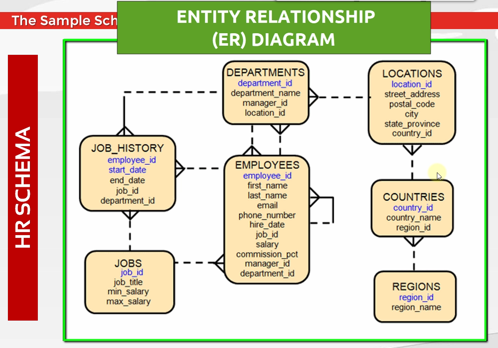

- __Entity Relationship Diagram__
- The three lines at the end of each line represent one-to-many relationships
    - For example: There can be many locations whose `country_id` is set to the
      same country.

### What is SQL?

__Structured Query Language__

- Language used to interact with the database.
- __Ansi SQL__ is the standard used across all DBMS.
    - __A__ merican __N__ ational __S__ tandards __I__ nstitute

#### Where is SQL used?

- BI, Data Science, Database Administration, Web Development, etc.

# Section 2: Download & Installation

## General Notes

### Best ways to install Oracle DB

1. Use VirtualBox
    - Recommended
    - Uses a __VM__ (Virtual Machine)
2. Install directly to your PC
3. Oracle Live SQL

#### Unlocking HR in local install

Run the [Unlock Script](./assets/(Oracle+Master+Training)+-+Scripts+to+Unlock+the+HR+Schema.pdf)
in CMD:

```sql
sqlplus
/ as sysdba;
alter
session set container=orclpdb;
alter
pluggable database open;
alter
pluggable database orclpdb save state;
alter
user hr identified by hr account unlock;
/
```

1. Connect as the __sys__ or __system__ user.
2. Run the SQL script found in [SQL Script](./HR_schema.sql)
   by hitting __Run Script (F5)__ in SQL Developer.

- SQL Plus a tool that allows you to connect to the database

## Creating a Connection

- There is a __tnsnames.ora__ file inside __your_database_folder__/network/admin
    1. Create another user __ORCLPDB__ and copy the config from __ORCL__
    2. Change the `SERVICE_NAME` to match the newly created one
    3. Change __hr__ to use __TNS__ and this new type.

1. Click the __Plus__ button and create a new connection.
2. Write a name (Use _hr_ to keep it simple)
3. Fill in the _username_ and _password_.
    - Passwords __are__ case-sensitive
    - Default _hr_ per the code above
    - Tick the _save password_ option
4. Select _Service Name_.
5. Write the pluggable database name that was created
    - Default is __orclpdb__.
6. Change connection type to __TNS__
7. We're interested in the CDB (Container DataBase), so select it.
    - If it's not there, go to _Services_ and start the Oracle services (If they
      aren't already running).
8. Click your connection and click SQL Worksheet above (Green button)
    - _Alternative:_ Right-click on the connection you want, and hit _connect_.
9. Create the other databases using the files in [Install Script](./assets/sample_schemas/Installation+Code.txt)
    - Must be in the root of the same drive as the database folder

#### System

Normal user with __dba__ privilege.

#### sys

Highest privilege user in the oracle DB.

## SQL Statements Used In This Course

- __DML (Data Manipulation Language)__
    - `SELECT`
    - `INSERT`
    - `UPDATE`
    - `DELETE`
    - `MERGE`
- __DDL (Data Definition Language)__
    - `CREATE`
    - `ALTER`
    - `DROP`
    - `RENAME`
    - `TRUNCATE`
- __DCL (Data Control Language)__
    - `GRANT`
    - `REVOKE`
- __TCL (Transaction Control Language)__
    - `COMMIT`
    - `ROLLBACK`
    - `SAVEPOINT`

|   DML<br/>(Data Manipulation Language)    |  DDL<br/>(Data Definition Language)  | DCL<br/>(Data Control Language) |  TCL<br/>(Transaction Control Language)   |
|:--------:|:----------:|:-------------------------------:|:-----------:|
| `SELECT` |  `CREATE`  |             `GRANT`             |  `COMMIT`   |
| `INSERT` |  `ALTER`   |            `REVOKE`             | `ROLLBACK`  |
| `UPDATE` |   `DROP`   |                                 | `SAVEPOINT` |
| `DELETE` |  `RENAME`  |                                 |             |
| `MERGE`  | `TRUNCATE` |                                 |             |

# Section 3: Retrieving Data

## General Notes

- Right-click to the left of the code, and click _toggle line numbers_ to make
  them appear.
- In the Oracle DB, there's a table called __dual__. It's a dummy table with a
  single row, used for `SELECT`ing something when you are not interested in the
  data, but instead the results of some function.

## SQL Statement Basics

- SQL statements are not case-sensitive.
    - User variables should be lower-case, and SQL commands should be upper.
- SQL Statements can be separated into multiple lines
- Keywords cannot be abbreviated or split
- IN SQL Developer, the delimiter is `;` or `/`.
- To use SQLPlus instead:
    1. Connect using `sqlplus <user>/<pass>@<PDB name>`

## Oracle Data Types

- `VARCHAR2(size)` __(Variable-length character data)__
- `CHAR(size)` __(Fixed-length character data)__
- `NUMBER(p, s)` __(Variable-length numeric data)__
    - __precision__ _and_ __scale__
- `DATE` __(Date and time values)__
- `LONG` __(Variable-length character data [up to 2 GB])__
    - Not recommended anymore.
    - Use `BLOB` _or_ `CLOB`
- `RAW` _and_ `LONG RAW` __(Raw binary data)__
    - Not recommended anymore.
    - Use `BLOB` _or_ `CLOB`
- `BLOB` __(Maximum size is __(4GB - 1) * (DB_BLOCK_SIZE initialization parameter (8TB to 128 TB))__)__
    - `LOB` stands for __L__ arge __OB__ jects
    - Mainly used for large blocks of unstructured data
        - Images, video, sound, etc
- `CLOB` __(Maximum size is __(4GB - 1) * (DB_BLOCK_SIZE)__)__
    - `LOB` stands for __L__ arge __OB__ jects
- `BFILE` __(Binary data stored in an external file (up to 4GB))__
    - External __LOBs__
    - Read only
    - Stores a pointer to a file. Limited by the OS.
- `ROWID` __(A base 64 number system representing the unique address of a row in its table.)__

### NULL

Marker that indicates that the data does not exist in the database. __Null means
Unknown or non-existent__.

- Not the same as an __empty string__, __0__, or __space__
    - `NULL` doesn't take up space in the physical disk, while these do
    - `NULL` values are not counted as rows while these are

### DESCRIBE

Describes the structure of a table

```sql
DESC[RIBE] table_name;
```

- Column names
- Nullable or not
- Data types of columns

SQL Developer has its own version:

1. Double-click any table in the script
2. Hit Shift + F4

- 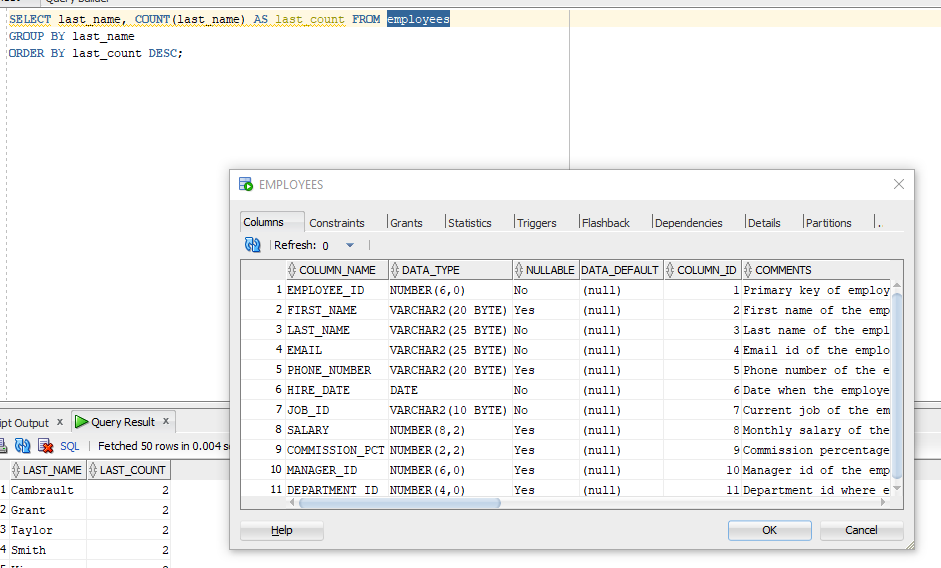

### INFORMATION

Improved version of the `DESCRIBE` command.

```sql
INFO
[RMATION] table_name;
    
INFO
[RMATION]+ table_name;  -- Provides even more information about the columns
```

- The column with the asterisk next to it is the Primary Key.

### Error codes

Always start with __ORA__ followed by a number code

- If the error is too basic or common, the __cause__ and __action__ fields will
  be empty.
- Type the exact error into google to solve it, if the explanation given is bad.

### SELECT

Used to retrieve data from the database.

```sql
SELECT *
FROM < table >;
```

- Selecting fewer columns means better and faster performance

### Column Aliases

Renames a column heading.

```sql
SELECT first_name AS name, last_name AS surname, email
FROM employees;

-- It's also possible to not use AS, and just use double quotes.
SELECT first_name "name", last_name AS surname, email
FROM employees;
```

- Useful for calculations (Used quite often)
- Should be used with double quotes if column contains special characters, space
  characters, or handling case-sensitivity.

### Quote Operator

Used to increase readability and usability. Writes special characters without the
need to escape them.

```sql
SELECT q '[Text]' my_text
FROM dual;
```

- `Text` will be the value in the row
- `my_text` will be the name of the column
- Any character can be used as a delimiter, although brackets are expected.
- To escape a single quote character, you must use two single quotes, unless
  using the quote operator.

```sql
SELECT q '[It's a good day today mate]' AS "Quote Operator" FROM dual;
```

### DISTINCT and UNIQUE

Used to eliminate duplicate rows

```sql
SELECT DISTINCT < column >
FROM < table >;
SELECT DISTINCT < column >, < column >
FROM < table >;

SELECT UNIQUE <column>
FROM < table >; -- Not standard and not always recognized
```

- Row-based operator, not column. Only one `DISTINCT` is needed in a query.
- If multiple columns are used with `DISTINCT`, then it returns all the unique
  combinations of those columns.

### CONCAT

Combines strings and outputs into a single columns.

```sql
SELECT < column > || < column >
FROM < table >;

-- Method 2
SELECT CONCAT(
           <column>, <column>
           )
FROM < table >;
```

- Concatenating with `NULL` does not return `NULL`, it returns the other char strings.

### Arithmetic Expressions

| Operators |  Description   |
|:---------:|:--------------:|
|     +     |    Addition    |
|     -     |  Subtraction   |
|     *     | Multiplication |
|     /     |    Division    |

- PEMDAS applies
- Can contain column names, numeric numbers, and arithmetic operators.

Arithmetic operations with date values return new dat values:

```sql
SELECT sysdate + 3
FROM dual; -- Three days after today.
```

- Any operation that contains a `NULL` will return `NULL` regardless of if either
  side had a value.

# Section 4: Restricting Data

## General Notes

## WHERE

Limits the rows returned by a query.

```sql
SELECT *|{[DISTINCT] column [alias],...}
FROM < table >
    [
WHERE logical expression (s)];

-- Example
SELECT *
FROM employees
WHERE job_id = 'IT_PROG';
```

- Used with the following:
    - Comparison Operators
        - `=`, `<`, `>`, `<=`, `>=`, `<>`, `!=`
    - `BETWEEN...AND`, `IN`, `LIKE`, and `NULL`

### Comparison Operators

- `<>` is __not equal to__.
    - The same as `!=`

### BETWEEN...AND

Retrieves data between the specified lower and upper limit

- The lower and upper limit values __are included__.

```sql
SELECT <columns>
FROM < table >
WHERE < column > BETWEEN < value > and < value >; 
```

### IN

Used to retrieve the restricted values in a specified list

- Order of specified values is not important

```sql
SELECT <columns>
FROM < table >
WHERE < column > IN ([list of possible values])

-- Example
SELECT employee_id
FROM employees
WHERE employee_id IN (100, 105, 102, 200)
```

- Up to 1,000 values can be used in the list, but it's not recommended due to
  speed.
- If you're not sure if a value is in a database, don't use it in an `IN` clause.
- Without an index, the data will be returned in insertion order.

### LIKE

Used to perform a wildcard search and retrieves rows matching a certain character
pattern.

| Symbol |    Character    |                               Description                                |
|:------:|:---------------:|:------------------------------------------------------------------------:|
|   %    | Percentage Sign | Matches any number<br/>of characters including<br/>0 or more characters. |
|   _    |   Underscore    |                    Matches exactly<br/>one character.                    |

```sql
SELECT <columns>
FROM < table >
WHERE < column > LIKE '%val_to_find%';
```

- Much slower than equal (`=`) search

### IS NULL

```sql
SELECT *
FROM < table >
WHERE < column > IS [NOT] NULL;
```

- `= NULL` is __not the same as__ the `IS NULL`

### Logical Operators

Allow us to use more than one operator in the `WHERE` clause.

```sql
SELECT *
FROM < table >
WHERE [conditions] AND [conditions];
```

- `AND` __(True if all conditions are met)__
- `OR` __(True if any conditions are met)__
- `NOT`

### Rules of Precedence

The order the expressions in a `WHERE` clause are performed:

| Order |               Meaning               |
|:-----:|:-----------------------------------:|
|   1   |        Arithmetic Operators         |
|   2   |       Concatenation Operator        |
|   3   |        Comparison Conditions        |
|   4   | `IS [NOT] NULL`, `LIKE`, `[NOT] IN` |
|   5   |           `[NOT] BETWEEN`           |
|   6   |             Not Equal To            |
|   7   |       `NOT` logical Operator        |
|   8   |       `AND` Logical Operator        |
|   9   |        `OR` Logical Operator        |

- Use parenthesis to avoid logical order confusion, or to change the order
  specifically.
    - Increases code readability

# Section 5: Sorting Data

## General Notes

- Use `set linesize <amount>` in sqlplus to make it more readable.

## Order By

Changes the returning rows' order by any column, alias, or numeric positions of
the columns in the `SELECT` list.

```sql
SELECT <columns>
FROM < table >
WHERE [conditions]
ORDER BY < column >;

SELECT column1, column2
FROM < table >
WHERE [conditions]
ORDER BY 1; -- Orders by column1

SELECT column1, column2 AS col
FROM < table >
WHERE [conditions]
ORDER BY col; -- Orders by column2
```

- Can sort by ascending (ASC - Lowest to highest) or descending (DESC - Highest
  to lowest).
    - Default is ascending
- Can be used with multiple columns.
    - Will be sort each column from left to right, without changing the sorting
      of the previous columns (same entry).

### ASC and DESC

```sql
SELECT column1, column2
FROM < table >
WHERE [conditions]
ORDER BY column2 DESC, column1 ASC;
```

- Queries can be ordered by columns in ascending or descending order individually.
- Aliases and numeric positions for columns can also be sorted by asc or desc.
- `NULL` values are displayed last in ascending order.
    - They cannot be sorted, so they are returned after.

### NULLS FIRST and NULLS LAST

The `NULLS FIRST` or `NULLS LAST` operators are used for changing the order of
the `NULL` values.

```sql
SELECT column1, column2
FROM < table >
WHERE [conditions]
ORDER BY
    column2 [ASC | DESC] NULLS [FIRST | LAST],
    column1 [ASC | DESC] NULLS [FIRST | LAST];
```

### ROWID and ROWNUM

- `ROWID` __(Unique identifier that contains the physical address of a row).__
    - Oracle automatically generates a unique `ROWID` at the time of insertion of
      a row.
    - Static and does not change so long as the row is not dropped.
    - Contains:
        - Disk Number
        - Cylinder
        - Block Number
        - Block Offset
        - Etc.
    - Very fast for queries if you know it.
- `ROWNUM` __(Nothing but the consecutive logical sequence number given to the
  rows fetched from the table).__
    - To limit the returning rows in a table, you can use the `ROWNUM` pseudo
      column.
    - Temporary. If you change the query, the `ROWNUM` will refer to another row.

```sql
SELECT <columns>
FROM (
    SELECT <columns>
    FROM < table >
    WHERE [conditions]
    ORDER BY < column > DESC;
    )
WHERE ROWNUM <= 5;
```

- The `ORDER BY` applies __after__ the `LIMIT` (MySQL command), so a sub-query
  is necessary to get the correct rows.

## FETCH

Used in conjunction with the `SELECT` and ORDER BY` clauses to limit the rows and
retrieve a portion of the returning rows.

```sql
[OFFSET rows_to_skip ROW[S]]
    FETCH [FIRST|NEXT] [row_count | percent PERCENT] ROW[S] [ONLY | WITH TIES];
```

- `OFFSET` __(Specifies the number of rows to skip before the row limit starts).__
    - If you put __5__, then it will skip the first 5 rows and start at row __6__.
    - If a negative number is given, it will consider it as __0__.
    - If the number is `NULL` or greater than the amount of rows there are, no row
      is returned.
    - If a decimal is given, the fractional part of the number is ignored.
- `ROW | ROWS` __(Both of them can be used based on the returning rows in order
  to increase the semantic clarity).__
    - Either can be used. It's just for semantics and readability. There's no
      difference.
- `FETCH` __(Specifies the number of rows or percentage of rows to return).__
- `FIRST | NEXT` __(You can use either based on the situation, to increase
  semantic clarity).__
- `row_count | percent PERCENT` __(The `row_count` specifies the number of rows
  to return. The `PERCENT` specifies the percentage of the total number of
  selected rows to return).__
- `ONLY | WITH TIES` __(`ONLY` is used to return exactly the specified number of
  rows or percentage of rows. The `WITH TIES` returns extra rows with the same
  value as the last row fetched).__
    - If you specify `WITH TIES`, then you must specify the `ORDER BY` clause. If
      you don't specify the `ORDER BY` clause, then no additional rows will be
      returned.

### Examples

```sql
-- Example 1
SELECT first_name,
       last_name,
       salary
FROM employees
ORDER BY salary DESC
OFFSET 1 ROW;

-- Example 2
SELECT first_name,
       last_name,
       salary
FROM employees
ORDER BY salary DESC
OFFSET 1 ROW FETCH FIRST 10 ROWS ONLY;

-- Example 3 (Returns NULL because the offset is NULL)
SELECT first_name,
       last_name,
       salary
FROM employees
ORDER BY salary DESC
OFFSET NULL ROW FETCH FIRST 15 ROWS only;
```

# Section 6: Using Subsitution Variables

## General Notes

## Ampersand (&)

Placeholders in a SQL script where you want to subsitute some values at runtime.

- Not the future of SQL.

```sql
-- For whole values
SELECT <columns>
FROM < table >
WHERE < column > = &<variable_name>;

-- For strings or dates
SELECT <columns>
FROM < table >
WHERE < column > = '&<variable_name>';
```

- The ampersand __(&)__ is used before the name of the variable
    - The name cannot contain a space
    - Single quotes must enclose the variable name for a __string__ or __date__.
- Does __not__ save the value
- Columns, aliases, and numerical positions are all valid when giving variable
  values.
- Multiple variables can be used almost everywhere.
    - ```sql
  SELECT &column
  FROM &table
  WHERE &condition
  ORDER BY &order_by_clause;
    ```
- __Verification Lines__ are the lines that show the old and new values in SQLPlus.

## Double Ampersand (&&)

Same as the normal variable, although the value is stored for the duration in the
variable name for use multiple times.

```sql
SELECT <columns>,
    &&<variable_name>
FROM < table >
WHERE < column > = &<same_variable_name>;
```

- To reuse the variable, only one ampersand __(&)__ is required.
- Can be very useful for checking queries with different values for testing.
- Variable must be `UNDEFINE`d for

## DEFINE _and_ UNDEFINE

### `DEFINE` is used to define a new user-variable and assign it a value.

- Can be used to display the value of a specific user variable or to display
  the values of all user variables.

```sql
DEF
[INE] variable_name = value;
    
-- Example
DEFINE
col = department_id;

SELECT employee_id,
       first_name,
       last_name,
    &col
FROM employees
ORDER BY &col;
```

- Can be used in-place of ampersand __(&)__ characters.
- Takes precedence over double-ampersand __(&&)__ variables.
- `DEF` is the shorthand.

#### To See All Defined Variables:

```sql
DEF
[INE];
```

### `UNDEFINE` is used to un-define a variable.

```sql
UNDEF
[INE] variable_name;
```

- `UNDEF` is the shorthand.

## ACCEPT / PROMPT

The most reliable and robust method for getting input from the user is to
explicitly prompt for values using the ACCEPT and PROMPT commands.

```sql
ACCEPT
<var_name> PROMPT '<prompt to display to user>';
```

- `ACCEPT` __(Takes input from a user and stores it in a user variable).__
- `PROMPT` __(Used to display a message to the user for supplying a brief
  explanation of what your script is going to accomplish).__

## Set VERIFY ON / OFF

Displays the status of the variable before and after the substitution.

```sql
SET
VERIFY ON;

SET
VERIFY OFF;
    
-- Example
SET
VERIFY ON;

SELECT employee_id,
       first_name,
       last_name
FROM employees
WHERE employee_id = &emp_id;
```

#### Result:

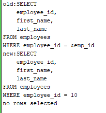

- Make sure to run script rather than query (__F5__ instead of __F9__) to see
  the result.

## Set DEFINE ON / OFF

Turns off variable defining. Will use any ampersands __(&)__ as normal ones.

```sql
SET
DEFINE ON;
    
SET
DEFINE OFF;
```

#### Must go after the variable that you don't want to be a variable:

```sql
SET
VERIFY OFF;

SELECT *
FROM departments
WHERE department_name = 'R\&D';

SET
DEFINE OFF;
```

# Section 7: Single-row Functions

## General Notes

- Functions must be created before calling them

### The two types of functions in Oracle DB:

1. __Single-Row Functions__
    - Takes in one input, and returns one output.
        - Returns a single value per row
    - Can be used alone, or nested
    - The __type__ returned and accepted for the parameter is __strongly typed.__
    - Can be used in `SELECT`, `ORDER BY`, `WHERE`, etc.
    - Types of single-row functions:
        - Character
        - Numeric
        - Date
        - Conversion
        - General
2. __Multiple-Row Functions__
    - Group Functions
    - Takes in multiple rows of input, and returns one output.

## Character Functions

Accept and return character or numeric data as input / output

#### Case Conversion Functions

- `UPPER` __(Converts all input characters to uppercase characters).__
- `LOWER` __(Converts all input characters to lowercase characters).__
- `INITCAP` __(Converts first letters of each word to uppercase, and the
  rest of them to lowercase).__

| Case Conversion Functions |   Result   |
|:-------------------------:|:----------:|
|   `LOWER('Adam SMITH')`   | adam smith |
|   `UPPER('Adam SMITH')`   | ADAM SMITH |
|  `INITCAP('Adam SMITH')`  | Adam Smith |

- If a non-alphabetic character is given, it will not be affected.

#### Character Manipulation Functions

- `SUBSTR`
- `LENGTH`
- `CONCAT`
- `INSTR`
- `TRIM`
- `LPAD | RPAD`

| Character Manipulation Functions Syntax                                            | Example                             | Result          |
|:-----------------------------------------------------------------------------------|:------------------------------------|:----------------|
| `SUBSTR(source_string, position[, length])`                                        | `SUBSTR('Sql Course', 1, 3)`        | Sql             |
| `LENGTH(string)`                                                                   | `LENGTH('Sql Course')`              | 10              |
| `CONCAT(string1, string2)`                                                         | `CONCAT('Sql', 'Course')`           | SqlCourse       |
| `INSTR(string, substring[,position, occurrence])`                                  | `INSTR('Sql Course', 'o')`          | 6               |
| `TRIM([[LEADING / TRAILING / BOTH] trim_character FROM] string)`  `('Sql Course')` | `TRIM('     Sql Course     ')`      | Sql Course      |
| `LTRIM(string, [trim_string])`                                                     | `LTRIM('    Sql Course     ')`      | Sql Course    _ |
| `RTRIM(string, [trim_string])`                                                     | `RTRIM('    Sql Course     ')`      | _   Sql Course  |
| `REPLACE(string, str_to_replace[, replacement_string])`                            | `REPLACE('Sql Course', 's', '*')`   | Sql Cour*e      |
| `LPAD(string, target_length, padding_expression)`                                  | `LPAD('Sql', 10, '-')`              | ----------Sql   |
| `RPAD(string, target_length, padding_expression)`                                  | `RPAD('Sql', 10, '-')`              | Sql----------   |

- `CONCAT` only accepts two parameters in Oracle DB.
- `INSTR`
    - `position` is the index of where it should start searching from
        - Also accepts negative index. However, it will start searching backwards
          from there.
    - `occurrence` is which found occurrence of the `substring` it should return.
- `TRIM`
    - Is set to `BOTH` by default.
    - A space __( )__ is the default character to trim. If another is specified,
      then `FROM` must be specified after.
    - Should only have on character

### Regular Expressions

| SQL Element      | Category    | Description                                                                                                                                                                                                                                                                                                                                                      | Example                                             |
|:-----------------|:------------|:-----------------------------------------------------------------------------------------------------------------------------------------------------------------------------------------------------------------------------------------------------------------------------------------------------------------------------------------------------------------|:----------------------------------------------------|
| `REGEXP_LIKE`    | `Condition` | Searches a character column for a pattern. Use this <br/>function in the `WHERE` clause of a query to return rows <br/>matching a regular expression. The condition is also <br/>valid in a constraint or as a PL/SQL function returning a <br/>boolean. The following `WHERE` clause filters employees <br/>with a first name of Steven or Stephen:                 | `WHERE REGEXP_LIKE(first_name, '^Ste(ph)en$')`      |
| `REGEXP_REPLACE` | `Function`  | Searches for a pattern in a character column and replaces <br/>each occurrence of that pattern with the specified string. <br/>The following function puts a space after each character in <br/>the `country_name` column:                                                                                                                                            | `REGEXP_REPLACE(country_name, '(.)', '\1 ')`        |
| `REGEXP_INSTR`   | `Function`  | Searches a string for a given occurrence of a regular <br/>expression pattern and returns an integer indicating <br/>the position in the string where the match is found. <br/>You specify which occurrence you want to find and the <br/>start position. For example, the following performs a <br/>boolean test for a valid email address in the `email` column: | `REGEXP_INSTR(email, '\w+@\w+(\.\w+)+') > 0`        |
| `REGEXP_SUBSTR`  | `Function`  | Returns the substring matching the regular expression <br/>pattern that you specify. The following function uses the <br/>`x` flag to match the first string by ignoring spaces in the <br/>regular expression:                                                                                                                                                    | `REGEXP_SUBSTR('oracle', 'o r a c l e', 1, 1, 'x')` |

#### Example

```sql
SELECT REGEXP_REPLACE(first_name, '^([aA])', 'BB') replaced_output,
       first_name
FROM employees
ORDER BY replaced_output
OFFSET 0 ROWS FETCH FIRST 10 ROWS ONLY;
```

## Numeric Functions

Accept numeric values as the input, and return numeric values as the output.

[All Numeric Functions](https://docs.oracle.com/cd/E49933_01/server.770/es_eql/src/ceql_functions_numeric.html)

#### Some Of The More Common Ones:

- `ROUND` __(Takes in a number and rounds it to the specified number of decimal
  places)__
- `TRUNC` __(Truncates values to the specified number of decimal places)__
    - Truncates to a whole number by default
- `CEIL` __(Return the smallest integer number greater than or equal to a
  specified number)__
- `FLOOR` __(Returns the highest integer number less than or equal to a specified
  number)__
    - Often used in place of `ROUND`
- `MOD` __(Returns the remainder of division)__

| Oracle Numeric Function    | Example            | Result |
|:---------------------------|:-------------------|:-------|
| `ROUND(number[, decimal])` | `ROUND(12.136, 2)` | 12.14  |
| `TRUNC(number[, decimal])` | `TRUNC(12.136, 2)` | 12.13  |
| `CEIL(number)`             | `CEIL(2.67)`       | 3      |
| `FLOOR(number)`            | `FLOOR(2.67)`      | 2      |
| `MOD(m, n)`                | `MOD(8, 5)`        | 3      |

- Using negatives with `ROUND` will go left instead of right.

## DATE Values & Formats in Oracle

`DATE` is the main datatype used in Oracle for storing date values.

- Seven-byte number that contains:
    - Century
    - Year
    - Month
    - Day
    - Hour
    - Minute
    - Second
- A few representations:
    - `DD-MON-RR`
    - `DD-MM-YY`
    - `DD/MM/YYYY`
    - etc.
    - To change the default in SQL Developer:
      > Tools
      > Preferences
      > Database
      > NLS
    - [Format models for Oracle Dates](https://docs.oracle.com/en/database/oracle/oracle-database/21/sqlrf/Format-Models.html#GUID-49B32A81-0904-433E-B7FE-51606672183A)

#### RR vs YY

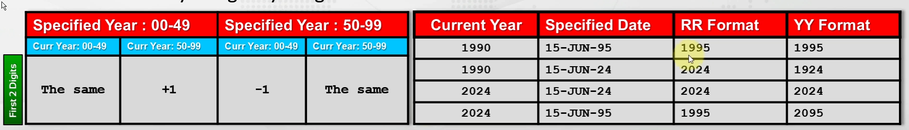

- `YY` __(Shows the last two digits of a year)__
    - Takes the first two digits of the current year directly
- `RR` __(Different time format element that allos us to show 20th-century dates
  in the 21st century using only 2 digits)__
    - Is _smart_ in that it will change the year based off if it thinks you mean
      past, present, or future.
- The last two digits never change for both, __only the first two digits change.__

## DATE Data Types in Oracle

- `DATE` __(The standard type that stores date values in Oracle)__
- `TIMESTAMP` __(This datatype stores year, month, day, hour, minute, second,
  ans fractional seconds)__
    - An extension of `DATE`.
- `TIMESTAMP WITH TIME ZONE` __(This data type is the same as `TIMESTAMP`, but
  it stores the timezone along with it)__
    - Shows the database timezone
- `TIMESTAMP WITH LOCAL TIME ZONE` __(This data type is similar to `TIMESTAMP
  WITH TIME ZONE`, but the stored timezone is the database's timezone)__
    - This timezone is converted to the local time of where the user performed the
      query.

## Oracle Date Functions

If the function name includes `CURRENT`, it's referring to the user. If the
function name includes `SYS`, it's referring to the database.

- `SYSDATE` __(Returns the current date and time of the OS where the Oracle
  database is installed)__
- `CURRENT_DATE` __(Returns the current date and time of the place where the
  user's session is logged in from)__
- `SESSIONTIMEZONE` __(Returns the time zone of the user's session)__
- `SYSTIMESTAMP` __(Returns the date and time of the database)__
- `CURRENT_TIMESTAMP` __(Returns current date and time from user's session)__

## Arithmetic Operations With Dates

We can add/subtract a number from a __date__, and the result will also be a
__date__.

```sql
-- Adding 2 Days
SELECT SYSDATE,
       SYSDATE + 2 -- Adds 2 days
FROM dual;

-- Adding 1 Hour
SELECT SYSDATE,
       SYSDATE + 1 / 24
FROM dual;

-- Adding 1 minute
SELECT SYSDATE,
       SYSDATE + 1 / (24 * 60)
FROM dual;

-- Example
SELECT employee_id,
       hire_date,
       sysdate,
       TRUNC((sysdate - hire_date) / 365) worked_in_years
FROM employees
ORDER BY worked_in_years DESC;
```

- Subtracting 2 __dates__ from eachother returns the number of days between
  those two dates.

## Date Manipulation Functions

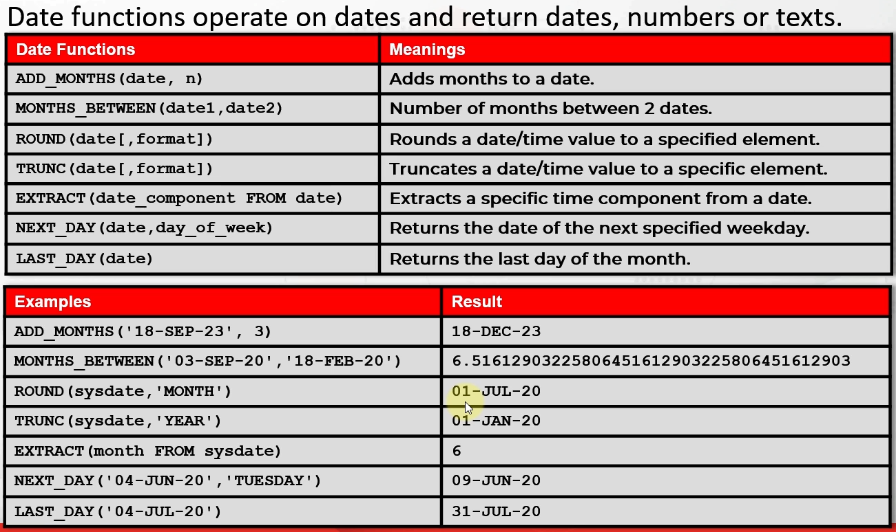

- If you're on the last date when using `ADD_MONTHS` and add a month, it will set
  the day to be the last day in that month.
- Oracle understands __date__ values and ignores the delimiters between them (so
  long as it's not a letter).
- `ROUND` is usually used with `MONTH` as the format.
    - It will round up if the day is greater than __15__, else it will round down.

# Section 8: Conversion Functions

## General Notes

There are two types:

1. Implicit Conversions
    - The server automatically converts some data type to the required one.
    - Not recommended due to problems and performance loss.
2. Explicit Conversions
    - Done using the conversion functions explicitly

- `TO_CHAR()` __(Converts the __number__ or __date__ to the `VARCHAR2` data
  type in the specified format model)__
- `TO_NUMBER()`
- `TO_DATE()`

## TO_CHAR

```sql
TO_CHAR
(date | number, [format_model], [nls_parameter])
```

- `date | number` __(Value to be converted to `VARCHAR2` type. Can be a date
  or number)__
- `format_model` __(Input value is converted to the VARCHAR2 data type in
  the specified format model)__
- `nls_parameter` __(Specified the language for the names and abbreviations
  of the days and months)__
    - E.g., Monday <-> Mon, January <-> Jan, etc.
    - __N__ ational __L__ anguage __S__ upport
    - Default system language is used it this isn't specified

### Examples

```sql
-- Example 1
SELECT first_name,
       last_name,
       TO_CHAR(hire_date, 'YYYY')
FROM employees
WHERE TO_CHAR(employee_id) = '100';

-- Example 2
SELECT first_name,
       hire_date,
       TO_CHAR(hire_date, 'YEAR-RR') formatted_date
FROM employees;
```

### Date Format Models

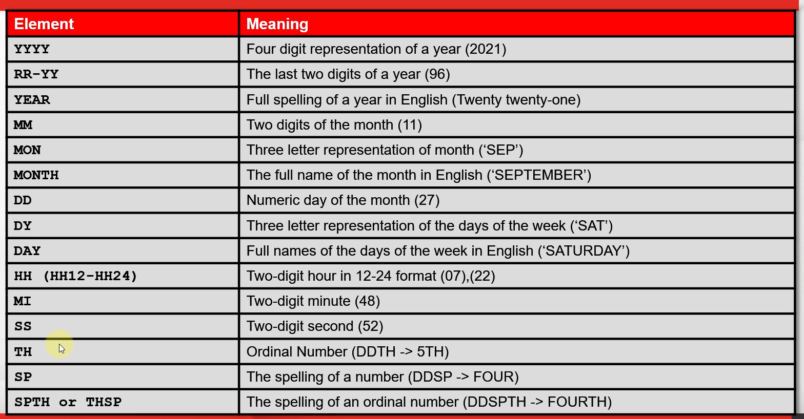

- The `format_model` is case-sensitive, returning either upper, lower, or initcap.
- `TH`, `SP`, `SPTH`, and `THSP` adds the letters onto the numbers
    - E.g.
        - `DDTHSP`
        - `DDTH`

### Number Format Models

| Number format Models | Meaning                                 |
|:---------------------|:----------------------------------------|
| __9__                | Specified the number of digits          |
| __0__                | Specified the leading or trailing zeros |
| __$__                | Adds dollar sign                        |
| __L__                | Displays local currency symbol          |
| __.__                | Displays a decimal point                |
| __,__                | Displays comma as indicator             |

#### Using __9__ versus __0__

If there is no digit, `9` will leave that digit blank, and `0` will fill it in
with a __0__.

## TO_NUMBER

Converts text to a number.

```sql
TO_NUMBER
(char [, 'format_model']);
    
-- Example
SELECT TO_NUMBER('$5,332.33', '$99,999.00') AS formatted_number
FROM employees;
```

- The format model must fit the text, or it will return an error.

## TO_DATE

Converts the characters to a `DATE` data type in the specified format model.

```sql
TO_DATE
(char [, 'format_model']);
    
-- Example
SELECT first_name,
       last_name,
       TO_CHAR(hire_date, 'Month Ddspth, YYYY') "Hire Date"
FROM employees
WHERE hire_date > TO_DATE('12JUN2005', 'DDMMYYYY');
```

- `NVL`
- `NVL2`
- `NULLIF`
- `COALESCE`

## NvL Function

Replace a null value with a meaningful alternative

```sql
NVL
(Expression1, Expression2);
    
-- Example
SELECT job_id,
       first_name,
       last_name,
       salary + salary * NVL(commission_pct, 0) as commission_pct
FROM employees
ORDER BY commission_pct
    FETCH FIRST 10 ROWS
WITH TIES;
```

- If `Expression1` is null, then return `Expression2`.
  Else, return `Expression1`.
- __Types__ must be the same for both expressions.

## NVL2

Extends the functionality of `NVL`. Allows us to replace a value when __either__
a null or non-null value is encountered.

```sql
NVL2
(expression1, expression2, expression3);
    
-- Example
SELECT job_id,
       first_name,
       last_name,
       NVL2(commission_pct, 'has', 'has not') as commission_pct
FROM employees
ORDER BY commission_pct NULLS FIRST;
```

- If `expression1` is `NULL`, then return `expression2`. Else, return
  `expression3`.
- `expression1` does not have to be the same __type__ as the other expressions.

## NULLIF

```sql
NULLIF(expression1, expression2);
    
-- Example
SELECT first_name,
       last_name,
       LENGTH(first_name)                            AS len1,
       LENGTH(last_name)                             AS len2,
       NULLIF(LENGTH(first_name), LENGTH(last_name)) AS result
FROM employees
WHERE NULLIF(LENGTH(first_name), LENGTH(last_name)) IS NULL;
```

- Compares `expression1` and `expression2`. If they're equal, return `NULL`.
  else, return `expression1`.

## COALESCE

Improved version of the `NVL` function. Accepts a list of arguments and returns
the first one that evaluates to a non-null value.

```sql
COALESCE(expression1, expression2, ..., expressionN);
    
-- Example
SELECT state_province,
       city,
       COALESCE(state_province, city)
FROM locations;
```

- Accepts two or more parameters
- If all specified expressions are `NULL`, returns `NULL`.
    - This is avoided by putting a static value as the last parameter.
- All arguments must be the same __type__.

## Conditional Expressions

- `CASE`
- `DECODE`

## CASE Expression

### Two Ways To Use CASE Expressions

1. __Simple Case Expression__
    - Expression is stated at the beginning, and the possible results are checked
      in the condition parameters.
2. __Searched Case Expression__
    - The expressions are used within each condition without mentioning it at
      the start of the `CASE` expression
    - Good for making different comparisons

- Both return `NULL` if none are true, and no `ELSE` block is in place.

#### Simple Case Expression

```sql
CASE expression
    WHEN comparison_expression1 THEN result_1
    [WHEN comparison_expression2 THEN result_2
    ...
    WHEN comparison_expression3 THEN result_n
    ELSE result]
END;
```

- `expression` and `comparison_expression1` need to be the same data type, but
  `result_1` can be a different one.
    - All results must be the same data type.
- Commonly used one.

#### Searched Case Expression

```sql
CASE
    WHEN expression_1 = comparison_expression1 THEN result_1
    WHEN expression_2 = comparison_expression2 THEN result_2
    ELSE result
END;
```

- Different __types__ can be used for comparison.

#### Examples

```sql
-- Simple Case Expression
SELECT first_name,
       last_name,
       job_id,
       salary,
       hire_date,
       CASE job_id
           WHEN 'ST_MAN' THEN 1.20 * salary
           WHEN 'SH_MAN' THEN 1.30 * salary
           WHEN 'SA_MAN' THEN 1.40 * salary
           ELSE salary
           END AS updated_salary
FROM employees
WHERE job_id
          IN ('ST_MAN', 'SH_MAN', 'SA_MAN');

-- Searched Case Expression
SELECT first_name,
       last_name,
       job_id,
       salary,
       CASE
           WHEN job_id = 'ST_CLERK' THEN salary * 1.2
           WHEN job_id = 'ST_REP' THEN salary * 1.3
           WHEN job_id = 'IT_PROG' THEN salary * 1.4
           WHEN last_name = 'King' THEN salary * 1.4
           ELSE 0
           END AS updated_salary
FROM employees;

-- Subquery
SELECT first_name,
       last_name,
       job_id,
       salary
FROM employees
WHERE (CASE
           WHEN job_id = 'IT_PROG' AND salary > 5000 THEN 1
           WHEN job_id = 'SA_MAN' AND salary > 10000 THEN 1
           ELSE 0
    END) = 1;
```

## DECODE Function

Specific to Oracle and is an alternative to a `CASE` expression. Provides an
__if-then-else__ logic.

- `CASE` is an expression whereas `DECODE` is a function.

```sql
DECODE
(col | expression, search1, result1, [, search2, result2] ... [, default]);
    
-- Example
SELECT first_name,
       last_name,
       job_id,
       salary,
       hire_date,
       DECODE(job_id, -- column to compare
              'ST_MAN', salary * 1.20,
              'SH_MAN', salary * 1.30,
              'SA_MAN', salary * 1.40,
              salary -- default value
           ) AS updated_salary
FROM employees
WHERE job_id
          IN ('ST_MAN', 'SH_MAN', 'SA_MAN');
```

- The `default` value at the end is what to return as a default value.
- result expressions must be the same data type.
- Search expressions must be the same data type.

# Section 10: Group Functions

## General Notes

- Group functions are known as:
    - __Multiple-Row Functions__
    - __Aggregate Functions__

```sql
SELECT group_function([DISTINCT | ALL] column_name), ...
    FROM < table > [
WHERE condition];
```

- Operator on multiple rows and return one result for each group
    - Uses all the returned rows of `column_name`
- Usually used after the `SELECT` keyword.
- Multiple group functions can be used in a `SELECT` statement
- Group functions ignore `NULL` values, but you can use `NVL`, `NVL2`,
  `COALESCE`, `DECODE`, or `CASE` expressions to handle `NULL` values
- `ALL` is the default keyword.
- All group functions return `NULL` by default.
- If a group function is used in a query, then __all__ columns must be in
  a group function.

### Most Commonly Used

- `AVG` __(Returns the average value)__
- `COUNT` __(Returns the number of rows returned by a query)__
- `MAX` __(Returns the maximum value of the expression or a column)__
- `MIN` __(Returns the minimum value of the expression or a column)__
- `SUM` __(Returns the sum of the expression or column values)__
- `LISTAGG` __(Transforms and orders data from the multiple rows into a single
  list of values separated by a specified delimiter)__

## Count

Returns the number of rows returned by a query

```sql
COUNT([DISTINCT | ALL] expression)
```

- When using an asterisk with `COUNT(*)`, all `NULL` values are included.
    - When a column is given instead, all `NULL` values are ignored.

```sql
SELECT COUNT(*),
       COUNT(manager_id),
       COUNT(ALL manager_id),
       COUNT(DISTINCT manager_id)
FROM employees;
```

## SUM

Used for getting the sum of the column or expression you provide it with.

```sql
SUM([ALL | DISTINCT] expression);

SELECT SUM(salary),
       SUM(DISTINCT salary)
FROM employees;
```

- Used exclusively with __numeric data__.

## LISTAGG

Used to aggregate strings from data in columns in a table.

- Similar to `CONCAT`, but allows grouping
    - Concat values from separate rows into a single value
- Transforms data from multiple rows into a single list of values separated by a
  specified delimiter.

```sql
LISTAGG
(column_name [, delimiter]) WITHIN GROUP (ORDER BY sort_expression);
    
-- Example1
SELECT LISTAGG(first_name, ', ')
           WITHIN GROUP (ORDER BY first_name) AS employees
FROM employees
WHERE job_id = 'ST_CLERK';

-- Example2
SELECT LISTAGG(DISTINCT salary, ', ')
           WITHIN GROUP (ORDER BY salary DESC) AS employees
FROM employees
WHERE job_id = 'ST_CLERK';

-- Example 3

```

- `WITHIN GROUP` must be with the `(ORDER BY)` clause, but this entire section
  is optional if you don't need the results ordered.

# Section 11: Grouping Data

## General Notes

### Order of Execution

| Order | Clause   | Function                                 |
|:-----:|:---------|:-----------------------------------------|
|   1   | from     | Chooise and join tables to get base data |
|   2   | where    | Filters the base data                    |
|   3   | group by | Aggregates the base data                 |
|   4   | having   | Filters the aggregated data              |
|   5   | select   | Returns the final data                   |
|   6   | order by | Sorts the final data                     |

## GROUP BY

```sql
SELECT expression1,
       expression2, ..., expression_n,
    aggregate_function(aggregate_expression)
FROM < table >
    [
WHERE condition]
GROUP BY expression 1, expression 2, ..., expression_n
    [
ORDER BY order_expression];
```

- The columns that are not encapsulated in the `aggregate_function` must be
  written in the `GROUP BY` clause.
    - We don't need to use all the columns in the `GROUP BY` clause though.
- Column aliases cannot be used with the `GROUP_BY` clause.
- The `ORDER BY` clause cannot have any other individual columns than the `GROUP
  BY` clause has.

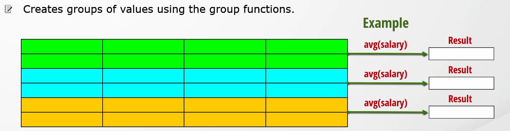

- Splits the rows into smaller groups and applies the group functions to each
  individually.

#### Example

```sql
SELECT job_id,
       department_id,
       ROUND(AVG(salary), 2),
       COUNT(*)
FROM employees
GROUP BY job_id,
         department_id
ORDER BY AVG(salary);
```

## HAVING

`HAVING` __filters grouped data__, while the `WHERE` clause __filters rows__.

```sql
SELECT < column >,
    group_function
from < table >
    [
WHERE condition]
    [
GROUP BY group_by_expression]
    [
HAVING group_condition]
    [
ORDER BY column];

-- Example
SELECT job_id,
       AVG(salary)
FROM employees
GROUP BY job_id
HAVING AVG(salary) > 10000;
```

- `HAVING` can actually be used before the `GROUP BY` clause, but it's not
  recommended due to readability.

## Nested Group Functions

```sql
SELECT MAX(AVG(salary))
FROM employees
GROUP BY department_id;
```

- Group Functions can be nested to a depth of 2.
- To use a nested multi-row function, you need to have a `GROUP BY` clause.

# Section 12: Joining Multiple Tables

## General Notes

- __Normalization__ __(The process of decreasing data redundancy by using keys
  and storing only specific information in a table)__
- [Create Payouts Table](./assets/NonEquiJoins+-+Source+Code.sql)

### Ambiguous Column Names

- An __ambiguous reference__ is when a join is performed on two tables that have
  the same column names in them.
- Table aliases are used for handling column ambiguity when joining two or more
  tables.
    - Increase code readability and query performance
    - If all table names are changed, the aliases will not need to be
    - We cannot give aliases to columns that we use with the `USING` clause or
      `NATURAL JOIN`

```sql
SELECT first_name,
       last_name,
       department_name,
       d.manager_id
FROM employees e
         JOIN departments d
              USING (departments_id);
```

## What is a join

A join is a concept that allows us to retrieve data from two or more tables in
a single query.

```sql
SELECT columns
FROM table1 JOIN_TYPE table2
ON table1.column_name = table2.column_name;
```

## Join Types

- Natural Join
- Inner Join
- Outer Join
    - Left Outer Join
    - Right Outer Join
    - Full Outer Join
- Equijoin
- Non-Equijoin
- Self Join
- Cross Join (Cartesian Product)

## NATURAL JOIN

Implicitly joins two tables based on common columns that have the same name and
same data type.

```sql
SELECT *
FROM table1
         NATURAL JOIN table2;
```

- The rows are matched with each other from two tables that have equal values in
  the common columns.
- If common columns have the same name but different types of data, it throws an
  error.
- `WHERE` can be used to restrict data
- Joined columns come first in the output, and are only written once.

## Join With The USING Clause (Equijoin)

When joining two tables, if there are more than one common columns that have the
same names, we can use the `USING` clause to specify which column needs to be
selected as the join column in the join operation.

```sql
SELECT <columns>
FROM table1
    JOIN table2
    USING (column_in_both_tables [, column_in_both_tables]);
```

- The `USING` clause is used for matching __a specific column or columns__ when
  joining two tables.
- Joining with the `USING` clause is considered as __Equijoin__.
    - When the columns must have equal values

## INNER JOIN

Returns all rows from both participating tables that satisfy the join condition
or the expression of the `ON/USING` clause.

```sql
SELECT columns
FROM table1 [INNER] JOIN table2
ON (join_condition) / USING (column_name)

-- Example1
SELECT e.first_name,
       e.last_name,
       d.manager_id,
       d.department_id
FROM employees e
         INNER JOIN departments d
                    ON (e.department_id = d.department_id AND e.manager_id = d.manager_id);

-- Example2
SELECT e.first_name,
       e.last_name,
       manager_id,
       department_id
FROM employees e
         JOIN departments d
              USING (department_id, manager_id);
```

- With the `ON` clause, we can write one or more join conditions even if they
  have different names. Only rows that satisfy these join conditions are
  included in the result set.
- The `USING` clause requires the columns to be the same name, where the `ON`
  clause can have different column names.

## Multiple JOIN Operations

```sql
SELECT e.first_name,
       e.last_name,
       d.department_name,
       l.city,
       l.postal_code,
       l.street_address,
       country_id
FROM employees e
         JOIN departments d
              ON e.department_id = d.department_id
         JOIN locations l
              ON d.location_id = l.location_id
         NATURAL JOIN countries
ORDER BY e.first_name, e.last_name
```

- The join order matters, because each `JOIN` result is stored in memory. The
  subsequent `JOIN` is then `JOIN`ed with the one in memory.
    - Only the columns from the selected table are stored.
        - If the needed column for a join is not yet joined, then the query will fail.
    - `NATURAL JOIN` can be problematic since it doesn't know what columns to join
      in advance. Don't use it.

## Restricting Joins

```sql
SELECT e.first_name,
       e.last_name,
       d.department_name,
       l.city,
       l.postal_code,
       l.street_address,
       country_id
FROM employees e
         JOIN departments d
              ON e.department_id = d.department_id
         JOIN locations l
              ON d.location_id = l.location_id
         JOIN countries
              USING (country_id) [AND |
WHERE] d.department_id = 100
ORDER BY e.first_name, e.last_name
```

- `AND` or `WHERE` can be used for restricting in `JOIN` clauses.
    - `WHERE` can only be used once

## SELF JOIN

Joining a table with itself is called a __Self-Join__

- Used for comparing rows in the same table or querying hierarchical data

#### Example

```sql
SELECT worker.first_name,
       worker.last_name,
       worker.employee_id,
       worker.manager_id,
       manager.employee_id,
       manager.first_name,
       manager.last_name
FROM employees worker
         JOIN employees manager
              ON worker.manager_id = manager.employee_id;
```

## Non-Equijoins (Joining Unequal Tables)

If two tables do not match with columns, we can join these tables using the
`BETWEEN` operator, or the comparison operators (<, >, <=, >=, <>).

```sql
SELECT e.employee_id,
       e.first_name,
       e.last_name,
       e.job_id,
       e.salary,
       j.min_salary,
       j.max_salary,
       j.job_id
FROM employees e
         JOIN jobs j
              ON e.salary > j.max_salary
                  AND j.job_id = 'SA_REP';
```

#### __Non-Equijoins__ are good for finding duplicates

```sql
SELECT e1.employee_id,
       e1.first_name,
       e1.last_name
FROM employees e1
         JOIN employees e2
              ON e1.employee_id != employee_id
    AND e1.first_name = e2.first_name;
```

## OUTER JOIN

Returns the matching rows from the joined tables, plus unmatched rows from one
or both tables.

- Very commonly used in real work, as the `JOIN` table is considered extra
  information, and often they want to see the actual table in any case.
    - An entire row is left out if even one piece of data is `NULL`
- There are three types of __outer joins__:
    1. `LEFT OUTER JOIN`
    2. `RIGHT OUTER JOIN`
    3. `FULL OUTER JOIN`

### LEFT OUTER JOIN

Returns the matching rows from the joined tables, plus unmatched rows from the
left table. For the unmatched rows, the values are shown as `NULL` for the other
table.

- The `OUTER` is optional.

### RIGHT OUTER JOIN

Returns the matching rows from the joined tables, plus unmatched rows from the
right table. For the unmatched rows, the values are shown as `NULL` for the other
table.

- The `OUTER` is optional.

### FULL OUTER JOIN

Retrieves all rows from both tables. If a match is found, it displays the
row. If not, it displays `NULL` for the other tables row.

```sql
SELECT e.first_name,
       e.last_name,
       d.department_name
FROM employees e
         FULL OUTER JOIN departments d
                         ON (e.department_id = d.department_id);
```

- The combination of the `LEFT` and `RIGHT` joins.
- The `OUTER` is optional

### CROSS JOIN (Cartesian Product & Cross Product)

Cross joins are used to return every combination of rows from two tables.

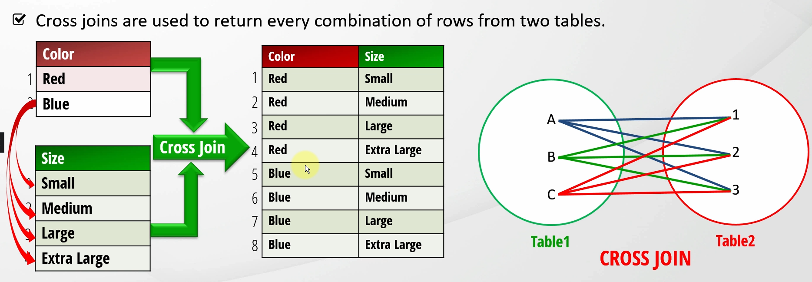

- Cross joins happen if you don't specify a `JOIN` between two tables, usually
  by accident.
    - Often happens if you use Oracle's old syntax.
- Can become exceedingly large when dealing with large tables.
- Generally used for performance testing or in DBA responsibilities.

#### Example

```sql
SELECT e.first_name,
       e.last_name,
       e.department_id,
       d.department_id,
       d.department_name,
       j.job_title
FROM employees e
         CROSS JOIN departments d
         CROSS JOIN jobs j;
```

##### An Accidental CROSS JOIN:

```sql
SELECT *
FROM employees,
     departments;
```

- Oracle's old syntax

## Older Join Syntax (Non-ANSI Standard)

```sql
SELECT e.first_name,
       e.last_name,
       d.department_name
FROM employees e,
     departments d
WHERE e.department_id = d.department_id
  AND d.department_name = 'Finance';
```

- In the older syntax, `WHERE` can also use all the `JOIN` clauses.
- The older syntax is error-prone

#### Outer Join In Old Syntax

```sql
-- LEFT OUTER JOIN
SELECT e.first_name,
       e.last_name,
       d.department_name
FROM employees e,
     departments d
WHERE e.department_id = d.department_id(+);

-- RIGHT OUTER JOIN
SELECT e.first_name,
       e.last_name,
       d.department_name
FROM employees e,
     departments d
WHERE e.department_id(+) = d.department_id;
```

- A __(+)__ is added to whichever table is optional.
    - In this scenario, it's a `LEFT` join.

##### FULL Outer Join in Old Syntax

```sql
SELECT e.first_name,
       e.last_name,
       d.department_name
FROM employees e,
     departments d
WHERE e.department_id(+) = d.department_id;
UNION
SELECT e.first_name,
       e.last_name,
       d.department_name
FROM employees e,
     departments d
WHERE e.department_id = d.department_id(+);
```

## Differences Between Inner / Outer Joins and Equi / Non-Equi Joins

- [Syntax Differences](./assets/Source+Code+-+Differences+Between+All+Types+of+Joins.sql)
- __Equijoin__ and __Non-Equijoin__ describe join conditions
    - How tables are joined and how rows are matched
- `INNER JOIN` and `OUTER JOIN` specify what to do with rows that do not satisfy
  the join condition.

## Which Join Should You Use

- Use the ANSI syntax
- Don't use the `NATURAL JOIN`s
- Use table aliases for a sustainable query

#### A Few Things To Consider

- Decide what you need
    - Do you need only the matched rows or not?
    - If you need the unmatched rows too, use an `OUTER JOIN`.
    - Do you need the matched rows and the unmatched rows from one table, or both
      tables?
    - Use the __Equijoins__ if you want to get only the rows which equally match with
      the join conditions.
    - Use the __Non-Equijoin__ if you want to get the rows which don't match equally.
    - Use the __Self Join__ if you want to join different rows of the same table
    - Use the __Cross Join__ if you need to generate massive amounts of data.

## Entity-Relationship Model in DBMS

There are three types of the Entity-relationship (data) models

1. __One-To-Many__ - __Many-To-One__
2. __One-To-One__
3. __Many-To-Many__

### One-to-Many / Many-to-One

Most used relationship. When one object from one table relates to many objects
from another table.

- A department can have many employees, but an employee cannot have many
  departments.
- A __One-to-Many__ does not need to have many each time. i.e., One customer
  does not need to have many orders. The important part is that it __can__ have
  many.

### One-to-One Relationship

If each row in the first table is joined with one row from the second table,
there is a __one-to-one__ relationship.

- Not used often.

### Many-to-Many Relationship

- I.e., Students and Classes table. A student can have many classes, and a class
  can have many students.
    - Instead of adding columns to account for classes, add a __linking / joining
      / bridging__ table.
        - It will contain the ID's from one table, and the ID's from another:
        - 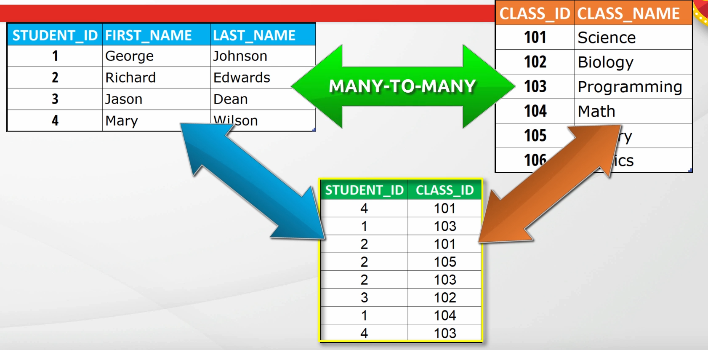

#### Junction Table

Sits between a __Many-To-Many__ table to join the tables.

- The convention is to name it the combination of the tables it's joining.
    - A __Students__ and __Classes__ table would be __Students_Classes__.

# Section 13: Using Subqueries (Nested Queries)

There are 3 types of subqueries:

1. __Single-Row Subqueries__
2. __Multiple-Row Subqueries__
3. __Multiple-Column Subqueries__

## Single-Row Subqueries

Return single rows and are used with single-row operators (<, >, =, <>, >=, <=)

```sql
SELECT *
FROM employees
WHERE department_id = (SELECT department_id
                       FROM employees
                       WHERE employee_id = 145);
```

- Group functions can be used within single row queries
- If a single-row subquery returns multiple-rows, it generates an error.
- If a subquery returns nothing or a `NULL` value, the main query will return
  nothing.

## Multiple-Row Subqueries

Return more than one row from the inner queries

#### Multiple-row operators:

- `IN`
    - Most commonly used
    - Checks whether a value matches __any values__ in a subquery
- `ANY`
    - Checks whether a value matches __at least one__ in a subquery
- `ALL`
    - Checks whether a value matches __all__ in a subquery

### IN

- Does not work with single-row operators

```sql
SELECT first_name,
       last_name,
       department_id,
       salary
FROM employees
WHERE salary IN (SELECT MIN(salary)
                 FROM employees
                 GROUP BY department_id)
ORDER BY salary;
```

### ANY

- Used with single-row operators

```sql
SELECT first_name,
       last_name,
       department_id,
       salary
FROM employees
WHERE salary > ANY (SELECT salary
                    FROM employees
                    WHERE job_id = 'SA_MAN')
ORDER BY salary;
```

### ALL

In multiple-row subqueries it's used to return values which provide the condition
with all elements of the inner query.

- Used with single-row operators
    - __<__ means __less__ than the maximum
    - __>__ means __more__ than the maximum
    - The __=__ is not used as it means nothing if there are more than one records.

```sql
SELECT first_name,
       last_name,
       department_id,
       salary
FROM employees
WHERE salary < ALL (SELECT salary
                    FROM employees
                    WHERE job_id = 'SA_MAN')
ORDER BY salary;
```

## Multiple Column Subqueries

Return more than one column to the outer query

- Useful when you need more than one inner query in one outer query
- Usually used with `IN` and `NOT IN` operators.

### Two Types of multiple-column subqueries

1. __Non-pairwise Comparison Subquery__
2. __Pairwise Comparison Subquery__

#### Non-pairwise Comparison Subquery

Like multiple-row subqueries with the `IN` operator, that we check multiple
column values with separate subqueries.

```sql
SELECT employee_id,
       first_name,
       last_name,
       salary
FROM employees
WHERE department_id IN
      (SELECT department_id
       FROM employees
       WHERE employee_id IN (103, 105, 110))
  AND salary IN
      (SELECT salary
       FROM employees
       WHERE employee_id IN (103, 105, 110));
```

- Each column is compared with a separate subquery

#### Pairwise Comparison Subquery

```sql
SELECT employee_id,
       first_name,
       last_name,
       salary
FROM employees
WHERE (department_id, salary) IN
      (SELECT department_id,
              MAX(salary)
       FROM employees
       GROUP BY department_id);
```

- `IN` ignores null values, so anyone without a department_id would be skipped
  without doing a pairwise-comparison.
- If a pairwise-comparison only returns one row, it's still a single-row subquery.

## Using Subqueries As A Table (INLINE __View__)

- __INLINE Views__ do not have to have one table, they can be joined.

```sql
SELECT e.employee_id,
       e.first_name,
       e.last_name,
       b.department_name,
       b.city,
       b.state_province
FROM employees e
         JOIN (SELECT department_id,
                      department_name,
                      state_province,
                      city
               FROM departments
                        JOIN locations
                             USING (location_id)
               ORDER BY department_id) b
              USING (department_id)
;
```

## Scalar Subqueries

If a subquery returns only one column for one row, it's a __Scalar Subquery__.

#### Example 1:

```sql
SELECT employee_id,
       first_name,
       last_name,
FROM employees
WHERE department_id =
      (SELECT department_id
       FROM employees
       WHERE UPPER(first_name) = 'LUIS');
```

#### Example 2:

```sql
SELECT employee_id,
       first_name,
       last_name,
       (CASE
            WHEN location_id =
                 (SELECT location_id
                  FROM locations
                  WHERE postal_code = '99236') THEN 'San Francisco'
            ELSE 'other'
           END) city
FROM employees
         NATURAL JOIN departments;
```

- If a scalar subquery returns `NULL` or 0 rows, the main query will return
  nothing.
- If a scalar subquery returns more than 1 row, the main query will return an
  error.
- Scalar subqueries can be used in:
    - `SELECT` statements
    - `DECODE` function and `CASE` expressions
    - `WHERE` clauses
    - `SET` clauses of `UPDATE` statements
    - `VALUES` clauses of `INSERT` statements
    - `ORDER BY` clauses
- Scalar subqueries are cached and reused if called more than once. Great for
  performance.
- Called __Selecting a Select__.
- If more than one row is returned from the subquery, use `IN` instead of `=`.

## Correlated Subqueries

When a subquery references to the columns from the parent query, it is called a
__correlated subquery__.

```sql
-- Example 1
SELECT employee_id,
       first_name,
       last_name,
       department_id,
       salary
FROM employees a
WHERE (salary, department_id) IN
      (SELECT MAX(salary),
              department_id
       FROM employees b
       WHERE b.department_id = a.department_id
       GROUP BY department_id);

-- Example 2
SELECT employee_id,
       first_name,
       last_name,
       a.department_id,
       salary
FROM employees a
         JOIN
     (SELECT AVG(salary) avg_sal,
             department_id
      FROM employees
      GROUP BY department_id) b
     ON (a.department_id = b.department_id)
WHERE a.salary < b.avg_sal;
```

- Correlated subqueries allow us to read every row in a table and compare values
  for each row against the related data.
    - In regular subqueries, they are executed first and the result of the
      subqueries are passed bqack to the parent query.
    - In correlated subqueries, the subquery is executed again and again for every
      row in the parent query.
- Correlated subqueries can use single-row and multi-row operators.
- Aka a __repeating subquery__ or __synchronized subquery__.
- These queries are slow, and using a `JOIN` often performs better.

## EXISTS Operator & Semijoins

### EXISTS

Uses to check the existence of rows in the subquery and match the records between
the subquery and main query.

```sql
SELECT employee_id,
       first_name,
       last_name,
       department_id
FROM employees a
WHERE EXISTS
          (SELECT NULL
           FROM employees
           WHERE manager_id = a.employee_id);
```

- Generally used with the correlated subqueries.
- Terminates the processing of the subquery once the subquery returns the first
  row.
- The subquery does not need to return a specific type of value. It can be a
  constant, a `NULL`, or a column value.
    - The subquery can also return more than one row.
- Returning `NULL` is better for performance when using `EXISTS`, but does not
  work with `IN`.

### Semijoins

A semijoin between two tables returns rows that match an `EXISTS` or `IN`
subquery without duplicating the rows of the main query even when there are
multiple matches from the subquery.

- An `EXISTS` or Subquery is a semijoin.

## NOT EXISTS Operator

Negation format of the `EXISTS` operator.

```sql
SELECT department_id,
       department_name
FROM departments d
WHERE NOT EXISTS
    (SELECT department_id
     FROM employees
     WHERE department_id = d.department_id);
```

- Using `NOT IN` can give unexpected behavior, so use `NOT EXISTS` instead.

# Section 14: Working With The Oracle SET Operators

SET operators return the results of two or more queries and return as one result.

```sql
SELECT column1, column2, ..., column_n
FROM table1
    SET_OPERATOR
SELECT column1, column2, ..., column_n
FROM table2
    SET_OPERATOR
SELECT column1, column2, ..., column_n
FROM table_n;
```

## Four Different Set Operators

1. `UNION` __(Returns <u>all rows</u> of both queries by <u>eliminating
   duplicate rows</u>)__
2. `UNION ALL` __(Returns <u>all rows</u> of both queries <u>including
   duplicates</u>)__
3. `INTERSECT` __(Returns <u>common rows</u> of both queries)__
4. `MINUS` __(Returns <u>unique rows</u> of first query)__
    - Shows results that only exist in the first query.

- Queries using the `SET` operators are called __Compound Queries__.
- All `SET` operators have __eqaul precedence__, except for `INTERSECT` which is
  higher.
    - Executed from top to bottom.
    - Use parenthesis to change execution order.
- The numbers of columns or expressions in queries must match.
    - The data types must match as well.
- The `ORDER BY` clause can only be used once at the end of the last query.
- Duplicate rows are eliminated automatically in all `SET` operators except for
  the `UNION ALL`.
- Column headings come from the __first query__.

### What's The Difference Between JOINS and SET Operators?

__JOINS__ combine columns, and __SET__ operators combine rows.

- If you have Table A and Table B and use a `JOIN`, then you get all the columns
  from both tables.
- If you have Table A and Table B and use a __SET__ operator, then you get all
  the rows from both tables under the columns from Table A.

## UNION Operator

Returns <u>all rows</u> of both queries by <u>eliminating duplicate rows</u>

Code for table: [Code](./assets/Source+Code+-+UNION+and+UNION+ALL+SET+Operators.sql)

- The `SELECT` order of the columns needs to be the same for both queries.

## UNION ALL Operator

Returns <u>all rows</u> of both queries <u>including duplicates</u>

## INTERSECT Operator

Returns <u>common rows</u> of both queries

## MINUS Operator

Returns <u>distinct rows from the first query</u> that are not returned by the
second query.

- All duplicates are eliminated, not just ones that exist in both tables.

## Matching Unmatched Queries

`NULL` values can be used to combine queries that do not have the same number of
columns.

```sql
SELECT job_id,
       department_id,
       first_name,
       last_name
FROM employees
UNION ALL
SELECT job_id,
       department_id,
       NULL,
       NULL
FROM job_history;
```

## Using ORDER BY Clause With SET Operators

Used only __once__ at the end of the compound query.

```sql
SELECT first_name,
       last_name,
       salary s,
       department_id
FROM employees
UNION ALL
SELECT first_name,
       last_name,
       salary s,
       department_id
FROM employees
WHERE department_id = 30
UNION
SELECT first_name,
       last_name,
       salary s,
       department_id
FROM retired_employees
ORDER BY s;
```

- It recognizes the column aliases __only in the first query__ when there's only
  two queries.
    - If there's more than 2 queries, the alias must be re-written for all queries
      except the last one.

# Section 15: Data Definition Language (DDL)

## General Notes

- __DDL__ commands create, modify, and maintain the database objects in the
  database.
    - They are always __auto-committed__.

### Commands

- `CREATE` __(Creates database objects in the database)__
- `ALTER` __(Modifies the structure of the database and its objects)__
    - Can modify almost anything
- `DROP` __(Deletes objects from the database)__
- `TRUNCATE` __(Removes all data from a table, including all space allocated for
  the removed rows)__
    - Cannot be rolled back
- `COMMENT` __(Adds explanatory comments to the table and its columns)__
- `RENAME` __(Renames an existing object)__

## Database Object Naming Rules

- Must start with a letter
- Can only contain A-Z, a-z, 0-9, _, $, #
- Can be up to 128 characters in length
    - __Tablespace Names__ and __Pluggable Database Names__ can only be up to 30.
- Cannot have the same name as another existing object in the same schema
    - Cannot have more than one column with the same name either.
- Quoted identifiers allow mixed case, but this is not recommended.
    - Column names are capitalized by default
- Cannot be a __reserved word__.

### Naming Conventions

- Table names should be in plural form.
- If a table has more than one word, they should be separated by an underscore
  (snake case).
- Column names should include the alias of the related table underscore the
  column name.
    - i.g., `adr_street`, `usr_first_name`
- Column names should be singular
- The primary key columns names should end with "___ID__"
- The logical aliases of both tables should be used while naming a foreign key
  column.

## CREATE TABLE Statement

- To create a table, you must have the __CREATE TABLE__ privilege.
- Up to 1,000 columns can be created per table.

```sql
CREATE TABLE schema_name.table_name
(
    column_name_1 datatype [ DEFAULT default_value] [NULL | NOT NULL],
    column_name_2 datatype [ DEFAULT default_value] [NULL | NOT NULL],
    column_name_3 datatype [ DEFAULT default_value] [NULL | NOT NULL], .
    .
    .
);
```

- The `schema_name` is optional. If not specified, the table will be created
  under the current schema.
- If `NULL` is specified, it means that it __can__ have a null value, not that it
  will.
    - `NULL` is the default if not specified.
- `DEFAULT default_value` sets the default value for the column.

## CREATE TABLE AS SELECT (CTAS) Statement

A table can be created using queries and populated with the rows returned by
the specified query.

- Great for creating test tables without affecting the main one.

```sql
CREATE TABLE table_name[
(
    column1,
    column2
    .
    .
    .
)]
AS select_query;

-- Example
CREATE TABLE employees_copy
AS
SELECT *
FROM employees;

-- Copying a table's structure without the data
CREATE TABLE employees_copy
AS (SELECT *
    FROM employees
    WHERE 1 = 2);
```

- The column names are optional if you want to have the same column names as the
  original table.
- While creating a table from a `SELECT` query, the only constraints that are
  inherited are the `NOT NULL` constraints.

Column names can be defined differently from the `SELECT` list while creating a
table:

```sql
CREATE TABLE employees_copy(name, surname, annual_salary)
AS
SELECT first_name, last_name, 12 * salary
FROM employees;
```

- The number of specified columns must match the number of columns in the
  `SELECT` list.

## ALTER TABLE Statement

Changes the structure of an existing table. A few possible commands:

- Add one or more new columns to a table.
- Modify the datat type of one or more existing columns.
- Drop one or more columns from a table.
- Rename a column or a table.
- Much more...

### ALTER TABLE ADD

```sql
ALTER TABLE < table_name >
    ADD (column_name_1 datatype [DEFAULT default_value] [NULL | NOT NULL],
    column_name_2 datatype [DEFAULT default_value] [NULL | NOT NULL],
    column_name_3 datatype [DEFAULT default_value] [NULL | NOT NULL],
    ...);

-- Example
ALTER TABLE employees_copy
    ADD (fax_number     VARCHAR2(11),
     date_of_birth  DATE,
     password       VARCHAR2(10) DEFAULT '@123abC');
```

### ALTER TABLE MODIFY

```oracle
ALTER TABLE table_name
    MODIFY (column_name_1 datatype [ DEFAULT default_value] [NULL | NOT NULL],
            column_name_2 datatype [ DEFAULT default_value] [NULL | NOT NULL],
            column_name_3 datatype [ DEFAULT default_value] [NULL | NOT NULL], ...);
```

- The most common use for `MODIFY` is to increase the size of a`VARCHAR2` column
  to allow for more space.
- A column will keep the same `DEFAULT` unless modified. The
  new data will be put in to new entries only.
    - Set it to `NULL` to delete the existing one if desired.

### ALTER TABLE DROP

```sql
ALTER TABLE table_name
DROP
COLUMN column_name;

ALTER TABLE table_name
DROP
(column_name1[, column_name2, ...]);
```

### ALTER TABLE "SET UNUSED" Option

The `SET UNUSED` clause is used to mark one or more columns as unused.

- When there's billions of values in a column, it may be faster to set a column as
  unused.
- As soon as columns are marked as unused, those columns are dropped logically by
  becoming invisible and inaccessible.
    - The column will still be on the disk physically, and can be dropped physically
      during off-peak hours.

```sql
ALTER TABLE table_name
    SET UNUSED COLUMN column_name;

ALTER TABLE table_name
    SET UNUSED (column_name1[, column_name2,...]);
```

#### ONLINE keyword

```sql
ALTER TABLE table_name
    SET UNUSED (column_name1[, column_name2,...]) ONLINE;
```

- The `ONLINE` keyword at the end of the `SET UNUSED` clause can be used to
  indicate that DML operations are allowed on the table while marking columns as
  unused.

#### Dropping UNUSED columns

```sql
ALTER TABLE table_name
DROP
UNUSED COLUMNS;
```

#### Querying Unused Columns

```sql
SELECT *
FROM user_unused_col_tabs;
```

- `user_unused_col_tabs` shows all `UNUSED` columns.

### READ-ONLY Tables

- A read-only table can still be __dropped__.

Some use-cases:

- We need to do maintenance on some tables. During these times, we may want to
  prevent any DML operations and certain DDL statements that affect the data on
  those tables against any accidental changes.

```sql
ALTER TABLE table_name READ ONLY;
```

- `READ ONLY` is added to the end of the table to make it read-only.

```sql
ALTER TABLE table_name READ WRITE;
```

- `READ WRITE` restores access to the table for writing operations.

## DROP TABLE Statement

Removes an existing table with all its data from the database and moves it to the
recycling bin.

```sql
DROP TABLE table_name [PURGE];
```

- `PURGE` removes the table and all its dependent objects permanently, skipping
  the recycling bin and making them unable to be recovered.
- To restore a table from the recycling bin:
    - ```sql
       FLASHBACK TABLE table_name TO BEFORE DROP;
    ```
        - You need to be a DBA, System Admin, or table creator to use `FLASHBACK`.
- After dropping a table, all the objects related to that table will also be
  deleted or become invalid.
- The recycle bin has a limit, and tables outside that limit will be deleted.

## TRUNCATE TABLE Statement

The `DELETE` statement deletes all data row by row whereas the `TRUNCATE`
statement deletes all rows from a table more quickly.

```sql
DELETE
FROM table_name; -- Deletes all data row by row (slow)

TRUNCATE TABLE [schema_name.] table_name; -- Deletes all rows at once (faster)
```

- `TRUNCATE` does not delete the table.
- `TRUNCATE` statement is one of the __DDL__ statements so it will auto-commit
  changes immediately after removing data.
    - Does not allow rollback.
    - Does not generate any undo information or log data, so it cannot be easily
      restored.
- DDL commands auto-commit after they're done.

## COMMENT Statement

Adds an explanation to a table or column.

```sql
-- Commenting a column
COMMENT
ON COLUMN table_name.column_name IS 'comment';

-- Commenting a table
COMMENT
ON TABLE table_name IS 'comment';
```

- We cannot drop a comment, so instead we create a new comment with an empty
  string.
- To query comments: `user_tab_comments` and `user_col_comments`

## RENAME Statement

Used to change the name of an existing column or table

```sql
-- Rename column
ALTER TABLE table_name RENAME COLUMN column_name TO new_column_name;

-- Rename table

-- Syntax 1
RENAME
table_name TO new_table_name;

-- Syntax 2
ALTER TABLE table_name RENAME TO new_table_name
```

# Section 16: Data Manipulation Language (DML)

## General Notes

- The DML statements are:
    - `INSERT` __(Add new rows into a table)__
    - `UPDATE` __(Update existing rows in a table)__
    - `DELETE` __(Can remove data from a table)__
    - `MERGE` __(Can perform all 3 of the above at the same time, based on specified
      conditions)__
- Other users will not see your __DML__ statements until you __commit__ them.

### Transactions

A collection of DML statements

- Databases use transactions that must be completed in full. If one DML statement
  fails, then they all fail.
- Used for data integrity, security, & consistency

## INSERT Statement

Adds one or more new rows into a table.

```sql
INSERT INTO table(column1, column2, ..., column_n)
VALUES (value1, value2, ..., value_n)
```

- Not all columns have to be specified, only the ones you want to fill when
  adding a row.
- Specifying the column names is optional for `table`, although it's recommended
  to as the order can be mixed up and incorrect data will be inserted.

#### Inserting NULL

```sql
INSERT INTO jobs_copy
VALUES ('DATA_ENG2', 'Data Engineer2', NULL, NULL);
```

- `NULL` can be used as a placeholder.
- Using `NULL` will prevent the `DEFAULT` value form being used.

#### Single-Row Functions

```sql
INSERT INTO jobs_copy
VALUES ('DATA_ARCH4', UPPER('DAta Architecture4'), 8000, NULL);
```

- Mulit-Row functions cannot be used

## INSERT INTO SELECT Statement

```sql
INSERT INTO target_table(col1, col2, col3, ...)
SELECT (col1, col2, col3, . . .)
FROM source_table;
```

- The data types and column amount must match.
- `source_table` is where the data comes from.
- It's good to run `SELECT` standalone first to make sure that it will return
  the correct data before it's inserted.
- The column list is optional for both:
    - ```sql
      INSERT INTO employees_copy
      SELECT * FROM employees;
      ```

## Mutlitable Insert Statements (INSERT ALL)

The `INSERT ALL` statement is used to insert multiple rows into a table or
multiple tables.

```sql
INSERT
ALL
    INTO table_name1 VALUES (val1, val2, val3, ...)
    INTO table_name2(col1, col2, col3) VALUES (val4, val5, val6, ...)
    INTO table_name3(col1, col2, col3, ...) VALUES (val7, val8, val9, ...)
    ...
Subquery;
    
-- Example
INSERT
ALL
    INTO employees_history VALUES (
                            employee_id, 
                            first_name, 
                            last_name, 
                            hire_date)
    INTO salary_history VALUES(
                            employee_id, 
                            EXTRACT(year FROM sysdate), 
                            EXTRACT(month FROM sysdate), 
                            salary, 
                            commission_pct)
SELECT *
FROM employees
WHERE hire_date > TO_DATE('15-MAR-08');
```

- Increases performance and saves time.
- Each row returned by the subquery is inserted into each of the target tables
  using the Unconditional `INSERT ALL` statement.
- If you need to insert hard-coded values, it's better to subquery from `dual`.
- The insert order is __not__ guaranteed, and is __not__ top to bottom.

## The Two Types

- __Unconditional Insert Statements__
- __Conditional Insert Statements__
    - Conditional Insert ALL Statements
    - Conditional Insert FIRST Statements

### Unconditional Insert Statements

```sql
INSERT
ALL
    INTO employees_history VALUES(
                            employee_id, 
                            first_name, 
                            last_name, 
                            hire_date)
    INTO salary_history VALUES(
                            employee_id, 
                            EXTRACT(year FROM sysdate),
                            EXTRACT(month FROM sysdate), 
                            salary, 
                            commission_pct)
SELECT *
FROM employees
WHERE hire_date > '15-MAR-08';
```

### Conditional Insert Statements

```sql
INSERT
ALL
    WHEN Condition1 THEN
        INTO Insert_satetement_1
        INTO Insert_satetement_2
        ...
    WHEN Condition2 THEN
        INTO Insert_Statement_3
        ...
    ELSE
        INTO Insert_statement_n
Subquery;
```

- <u>__All `WHEN` conditions__</u> are evaluated regardless of the results of any
  other `WHEN` clause.

#### Conditional INSERT FIRST Statements

```sql
INSERT
FIRST
    WHEN Condition1 THEN
        INTO Insert_satetement_1
        INTO Insert_satetement_2
        ...
    WHEN Condition2 THEN
        INTO Insert_Statement_3
        ...
    ELSE
        INTO Insert_statement_n
Subquery;
```

- Uses `IF-THEN-ELSE` logic.
    - When a condition is found that is satisfied, the subsequent statements are
      skipped.

## Pivoting INSERT Statement

Used for converting non-relational data to a relational format and inserting it
into a relational table.

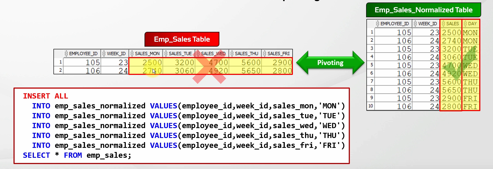

- An unconditional `INSERT ALL` statement can also be used for pivoting data.

### Mutli-Table Insert Statement Restrictions

- Can __not__ be used on views or materialized views.
- Cannot be used to insert data into __remote tables__.
- The number of columns in all the __INSERT INTO__ clauses must not exceed
  <u>__999__</u>.
- __A Table collection expression__ cannot be used in a multitable insert statement.
- The subquery of the multitable insert statement __cannot use a sequence__.

## UPDATE Statement

```sql
UDPATE
table
SET column = value [, column2 = value, ...]
[WHERE condition(s)];
    
-- Example
UPDATE employees_copy
SET salary        = 50000,
    department_id = NULL
WHERE job_id = 'IT_PROG';
```

### Updating Multiple Columns At Once

A subquery must be used to update multiple columns at once.

```sql
UPDATE employees_copy
SET (salary, commission_pct) = (SELECT MAX(salary),
                                       MAX(commission_pct)
                                FROM employees)
WHERE job_id = 'IT_PROG';
```

## DELETE Statement

Used to delete one or more rows from a table.

```sql
DELETE
[FROM] TABLE
[WHERE condition];
```

## MERGE Statements

Used to `INSERT` new records, `UPDATE` or `DELETE` existing ones depending on
the specified conditions at the same time.

- Optimized for merging sets of data.
    - Faster than the individual DML statements being used independently.

```sql
MERGE INTO taget_table target_alias
    USING (source_table|view|subquery) source_alias
    ON (join_condition)
    WHEN MATCHED THEN
        UPDATE SET
            column_name1 = value1,
            column_name2 = value2,
    ...
    [WHERE <
update condition>]
    [
DELETE
WHERE <
delete condition >]
    WHEN NOT MATCHED THEN
iNSERT
(
columns
)
VALUES (values)
    [
WHERE <
insert
condition
>
];

-- Example
MERGE INTO employees_copy c
    USING (SELECT *
           FROM employees) e
    ON (c.employee_id = e.employee_id)
    WHEN MATCHED THEN
        UPDATE SET c.first_name = e.first_name,
            c.last_name = e.last_name,
            c.department_id = e.department_id,
            c.job_id = e.job_id,
            c.salary = e.salary
DELETE
WHERE department_id IS NULL WHEN NOT MATCHED THEN
INSERT
VALUES (
    e.employee_id,
    e.first_name,
    e.last_name,
    e.department_id,
    e.job_id,
    e.salary
    );
```

## Transaction Control Language (TCL)

A transaciton is a unit of work that you want to treat as __a whole__. It
either has to happen __in full__ or __not at all__.

- Used to ensure __data integrity, data consistency__ and __data security__.
- When we execute a __DML__ operation, the affected rows are locked and no one
  else can update or delete these rows during this lock.
- There are 3 types of TCL Statements
    1. `COMMIT`
    2. `ROLLBACK`
    3. `SAVEPOINT`

### COMMIT & ROLLBACK Statements

#### ROLLBACK

Undoes any changes to the database and restores data to its previous state.

- Goes all the way back to the last commit (All changes made in the current
  transaction).
- After a commit or rollback operation, all the locked rows are released and
  everyone can change these rows.
- After a DDL or DCL statement, the commit will be automatically executed.

```sql
ROLLBACK;
```

#### COMMIT

Permanently saves the changes into the database and ends the transaction.

```sql
COMMIT;
```

## Row Lock In Oracle

During a DML operation, the rows are locked until a `COMMIT` or `ROLLBACK`
occurs.

- The session will be left hanging and the ScriptRunner Task will not finish
  if another user is making changes to that row.
    - It will be locked until the user commits or rolls back the changes.
    - Row locks are specific to individual rows.

## SAVEPOINT Statement

For longer transactions, save-points are useful as they divide longer transactions
into smaller parts nad mark certain points of a transaction as checkpoints.

```sql
SAVEPOINT name;

-- Rolling back to a savepoint
ROLLBACK TO [SAVEPOINT] savepoint_name;
```

- Saves the current state of the transaction, and we can roll back to that state.
- We can create as many save-points as we want.
- After rollback to an earlier savepoint, subsequent ones will be deleted and
  only the ones before it will still exist.
- Using a regular `ROLLBACK` without a save-point, or `COMMIT`, will delete all
  save-points.
- Save-point names must be unique within a transaction.
    - When using the same name, the new one will override the old one.
- Adding `SAVEPOINT` increases readability, but is optional.

#### Example

```sql
DELETE
FROM employees_copy
WHERE job_id = 'IT_PROG';
SAVEPOINT A;

UPDATE employees_copy
SET salary = 1.2 * salary;
SAVEPOINT B;


INSERT INTO jobs_copy
VALUES ('PY_DEV', 'Python Developer', 12000, 20000);
SAVEPOINT C;

DELETE
FROM employees_copy
WHERE job_id = 'SA_REP';
SAVEPOINT D;

ROLLBACK TO B;
```

## FOR UPDATE Statement

`FOR UPDATE` is a locking mechanism that locks all rows returned by a query.

```sql
SELECT *
FROM employees
WHERE job_id = 'IT_PROG'
    FOR UPDATE [OF column(s)] [NOWAIT | WAIT sec | SKIP LOCKED];
```

- It is not able to lock rows that are already locked by another session, it will
  wait.
- Used to deal with concurrent updates to data.
- `NOWAIT` tells Oracle not to wait if the rows have already been locked by
  another user.
    - If the rows are already locked by another user, Oracle will directly return
      an error.
- `SKIP LOCKED` keyword tells Oracle to skip the locked rows and operator on the
  available ones.
- With joins, the rows from all joined tables are locked by default.
- The `OF` clause is used to indicate which tables will be locked:
    - In Oracle, you cannot lock a specific column in a row. The entire row is
      locked.
- Constraint names must be unique for the entire schema.

# Section 17: Constraints

## General Notes

- Constraints restirct data entry (insert, update, delete) and __prevent invalid
  entries__.
    - They ensure __data consistency__ and __data integrity__ in the database.
- There are 5 constraint types:
    1. `NOT NULL`
    2. `UNIQUE`
    3. `PRIMARY KEY`
    4. `FOREIGN KEY`
    5. `CHECK`
- Constraints can be at the <u>__column-level__</u> or <u>__table-level__</u>
    - The functionality is the same, it's just where they're created.
    - Ones created table-level are applied to multiple columns.
- By default, auto-generated constraint names start with '__SYS_C__'.
- Constraint names must be unique.

```sql
CREATE TABLE managers
(
    employee_id   NUMBER [ CONSTRAINT constraint_name] CONSTRAINT_TYPE,
    first_name    VARCHAR2(50),
    last_name     VARCHAR2(50),
    department_id NUMBER, [
    CONSTRAINT
    constraint_name]
    CONSTRAINT_TYPE
(
    column_name1,
    .
    .
    .
) -- Table-level
    );
```

- There can be multiple table-level and column-level constraints
- Table-level constraints can have multiple columns in them.

## NOT NULL Constraint

Prevents the insertion of `NULL` values in a column.

```sql
CREATE TABLE managers
(
    employee_id   NUMBER NOT NULL,
    first_name    VARCHAR2(50),
    last_name     VARCHAR2(50) CONSTRAINT lname_not_null NOT NULL,
    department_id NUMBER NOT NULL
);
```

- Can only be created at the column-level

## UNIQUE Constraint

Ensures the uniqueness of a column or a set of columns which means no duplicate
values will be inserted.

```sql
CREATE TABLE managers
(
    employee_id   NUMBER NOT NULL,
    first_name    VARCHAR2(50) UNIQUE,
    last_name     VARCHAR2(50) CONSTRAINT lname_uk UNIQUE,
    department_id NUMBER NOT NULL,
    phone_number  VARCHAR2(11) UNIQUE NOT NULL,
    CONSTRAINT department_uk UNIQUE (department_id),
    CONSTRAINT    composite_uk(employee_id, first_name, last_name) -- Composite Unique Key

);
```

- A `UNIQUE` column or a set of columns where the combination must be unique
  can have multiple null values, unless you also define `NOT NULL` constraints
  for those columns.
- `UNIQUE` constraints based on multiple columns are called __Composite Unique
  Keys__.
    - A composite unique key can contain a maximum of 32 columns.
    - Composite unique keys can only be created at the table-level.
- Oracle server creates a unique index implicitly on unique key creation.
- The easiest way to figure out the meaning of a system-named constraint in
  Oracle is:
    1. Click the table
    2. Hit <u>__Shift + F4__</u>
    3. Go to constraints
    4. Click the related constraint name and look at the columns it's affecting.

#### Multi-Constraint-Name Example

```sql
CREATE TABLE managers
(
    manger_id     NUMBER
        CONSTRAINT mgr_mid_uk UNIQUE,
    first_name    VARCHAR2(50),
    last_name     VARCHAR2(50),
    department_id NUMBER NOT NULL,
    phone_number  VARCHAR2(11) CONSTRAINT pnum_uk UNIQUE CONSTRAINT pnum_nn NOT NULL
);
```

## PRIMARY KEY Constraint

A column or a combination of columns in a table that uniquely identifies each row
in a table.

- A combination of `NOT NULL` and `UNIQUE` constraints.
    - The `NOT NULL` constraint is automatically created on the related column(s)
      when creating a primary key.
- There can only be one primary key on the table.
- Primary key is the unique ID of each row in a table.
- The oracle server creates a `UNIQUE` index when creating a primary key.
- There are 2 types of primary keys:
    1. __Simple Primary Key__ _(Single Column)_
    2. __Composite Primary Key__ _(Multiple Columns)_

```sql
-- Column-level constraint
CREATE TABLE managers
(
    manager_id NUMBER
        CONSTRAINT pk_managers PRIMARY KEY,
    first_name VARCHAR2(50),
    last_name  VARCHAR2(50)
);

-- Table-level constraint
CREATE TABLE managers
(
    manager_id NUMBER,
    first_name VARCHAR2(50),
    last_name  VARCHAR2(50),
    CONSTRAINT pk_managers PRIMARY KEY (manager_id),
);
```

## FOREIGN Key

A column or combination of columns used to enforce a relationship between a
__parent table__ and a __child table__.

- The relationship is established between the parent table's primary/unique key
  and a column or set of columns in the child table.
- The Foreign Key constraint is also known as the __Referential Integrity__
  constraint.
- A referenced record must exist in the parent table before you can insert a
  related record into the child table.
-
    - There are 2 types of Foreign keys:

    1. __Simple Foreign Key__ _(Single Column)_
    2. __Composite Foreign Key__ _(Multiple Columns)_

```sql
CREATE TABLE managers
(
    manager_id    NUMBER
        CONSTRAINT pk_managers PRIMARY KEY,
    first_name    VARCHAR2(50),
    last_name     VARCHAR2(50),
    department_id NUMBER
        CONSTRAINT mgr_dept_id_fk REFERENCES departments (department_id),
    CONSTRAINT mgr_emp_fk FOREIGN KEY (manager_id) REFERENCES employees (employee_id)
);
```

- `FOREIGN KEY` isn't used on column-level restraints, as it's obvious.
- A column or group of columns can be both the `PRIMARY KEY` and the `FOREIGN
  KEY` at the same time.
    - In this example, every manager must be in the employees table, but not
      every employee must be in the managers table.
- Child records can be set to `NULL` even if the parent table doesn't have it.
    - Unless the child record is a `PRIMARY KEY` or has `NOT NULL` on it.

### Creating A Composite FOREIGN KEY

```sql
CREATE TABLE managers
(
    manager_id    NUMBER
        CONSTRAINT pk_managers PRIMARY KEY,
    first_name    VARCHAR2(50),
    last_name     VARCHAR2(50),
    department_id NUMBER
        CONSTRAINT mgr_dept_id_fk REFERENCES departments (department_id),
    phone_number  VARCHAR2(11) UNIQUE NOT NULL,
    email         VARCHAR(100),
    UNIQUE (email),
    CONSTRAINT mgr_emp_fk FOREIGN KEY (manager_id) REFERENCES employees_copy (employee_id),
    CONSTRAINT mgr_names_fk FOREIGN KEY (first_name, last_name) REFERENCES employees_copy (first_name, last_name)
);

CREATE TABLE employees_copy
(
    employee_id   NUMBER(6) CONSTRAINT emp_eid_pk PRIMARY KEY,
    first_name    VARCHAR2(20),
    last_name     VARCHAR2(20),
    department_id NUMBER(4),
    CONSTRAINT emp_cpy_names_uk UNIQUE (first_name, last_name)
);
```

- The referenced column or group of columns must have a `UNIQUE` or `PRIMARY`
  key on it.

## ON DELETE CASCADE | SET NULL

```sql
CREATE TABLE managers
(
    manager_id    NUMBER
        CONSTRAINT pk_managers PRIMARY KEY,
    first_name    VARCHAR2(50),
    last_name     VARCHAR2(50),
    department_id NUMBER
        CONSTRAINT mgr_dept_id_fk
            REFERENCES departments (department_id),
    phone_number  VARCHAR2(11) UNIQUE NOT NULL,
    email         VARCHAR(100),
    UNIQUE (email),
    CONSTRAINT mgr_emp_fk FOREIGN KEY (manager_id)
        REFERENCES employees_copy (employee_id) [ ON DELETE CASCADE | ON DELETE SET NULL],
);

-- Example
CREATE TABLE managers
(
    manager_id    NUMBER
        CONSTRAINT pk_managers UNIQUE,
    first_name    VARCHAR2(50),
    last_name     VARCHAR2(50),
    department_id NUMBER
        CONSTRAINT mgr_dept_id_fk
            REFERENCES departments (department_id),
    phone_number  VARCHAR2(11) UNIQUE NOT NULL,
    email         VARCHAR(100),
    UNIQUE (email),
    CONSTRAINT mgr_emp_fk FOREIGN KEY (manager_id)
        REFERENCES employees_copy (employee_id)
        ON DELETE SET NULL
);
```

- The `ON DELETE CASCASDE` clause deletes dependent rows in the child table when
  a related row in the parent table is deleted.
- The `ON DELETE SET NULL` clause updates dependent rows in the child table to
  `NULL` when a related row in the parent table is deleted.
- Both clauses can only be used table-level.

## CHECK Constraint

Ensures a column or a group of columns meets a specific condition.

- We cannot create `CHECK` constraints referencing another table.
- A `CHECK` constraint can be created at the column-level or table-level.

```sql
CREATE TABLE managers
(
    manager_id    NUMBER
        CONSTRAINT pk_managers PRIMARY KEY,
    first_name    VARCHAR2(50),
    last_name     VARCHAR2(50),
    department_id NUMBER CHECK (check_condition),
    salary        NUMBER,
    email         VARCHAR(100),
    CONSTRAINT mgr_salary_check CHECK (salary > 0 AND salary < 100000)
);
```

## Adding Constraints via ALTER TABLE

We can add, drop, enable, or disable constraints using `ALTER TABLE`.

### ADD

```sql
ALTER TABLE table_name
    ADD [CONSTRAINT constraint_name] CONSTRAINT_TYPE (column_name, ...);
```

- To add a `NOT NULL` Constraint, we use the `ALTER TABLE MODIFY` clause.
    - The table must be empty or all the values of the `NOT NULL` column __must
      have a value__.
- We cannot modify a constraint's structure. To do that we need to __drop and
  recreate the constraint__.
- Existing rows shouldn't violate the constraint

### DROP

We use the `ALTER TABLE` statement to remove a constraint.

```sql
ALTER TABLE table_name
DROP
CONSTRAINT constraint_name;
```

While dropping a `PRIMARY KEY` constraint, we can use the `CASCADE` option to
drop all the associated `FOREIGN KEY` constraints.

```sql
ALTER TABLE employees_copy
    DROP CONSTRAINT emp_cpy_emp_id_pk CASCADE;

-- Simpler Syntax
ALTER TABLE employees_copy
DROP
PRIMARY KEY CASCADE;
        
-- Online
ALTER TABLE employees_copy
DROP
PRIMARY KEY ONLINE
```

- We can use the `ONLINE` keyword to allow DML operations while dropping the
  constraints.
- `ONLINE` and `CASCADE` cannot be used together.

## Cascading Constraints

If we use the `CASCADE CONSTRAINTS` clause while dropping a column, all the
constraints referring to that column's `PRIMARY` and `UNIQUE` keys are dropped.

```sql
ALTER TABLE departments_copy
    DROP COLUMN department_id CASCADE CONSTRAINTS;
```

- If there's a multi-column constraint, we need to use the `CASCADE CONSTRAINTS`
  clause to drop the column, otherwise we will get an error.

## Renaming Constraints

We use the `ALTER TABLE ... RENAME CONSTRAINT` statement to rename one.

```sql
ALTER TABLE table_name
    RENAME CONSTRAINT old_name TO new_name;
```

## Disabling Constraints

A disabled constraint does not enforce its restriction on the DML operation
until it is re-enabled.

```sql
ALTER TABLE table_name
    DISABLE CONSTRAINT old_name;
```

- We cannot directly disable a constraint if there is one or more foreign keys
  referencing this constraint.
- We can use the `CASCADE` option to disable a constraint and all the dependent
  constraints.
- When we disable a unique or a primary key constraint, the Oracle Server will
  remove the unique indexes.
    - We can use the `KEEP INDEX` option to prevent this.

#### Adding a Disabled Constraint

```sql
ALTER TABLE table_name
    ADD CONSTRAINT constraint_name CONSTRAINT_TYPE DISABLE;
```

- It's also possible to create tables with disabled constraints.

## Enabling Constraints

```sql
ALTER TABLE table_name
    ENABLE CONSTRAINT old_name;
```

- There is no `CASCADE` option to enable constraints, and they must all be
  explicitly enabled.
- A unique index is automatically created by the Oracle Server when a unique or
  primary key constraint is enabled.
- To enable a constraint, all the data in the column or table must satisfy the
  constraint rules.

## Status of Constraints

- `VALIDATE` or `NOVALIDATE` can also be used with `ENABLE` and `DISABLE` for
  configuring __existing__ or __future__ data validation.
    - `VALIDATE` ensures that the existing data must conform to the constraint
      conditions.
    - `NOVALIDATE` is used to suspend the checking of existing rows for constraint
      violations.

#### The Four Options

- `ENABLE VALIDATE`
    - Default for the `ENABLE` clause.
    - All existing and future rows will be validated.
- `ENABLE NOVALIDATE`
    - Existing rows for not validated, but future ones will be.
- `DISABLE VALIDATE`
    - The constraint is disabled, but it remains valid. No DML operations are
      alowed on the table because the future changes will not be validated.
- `DISABLE NOVALIDATE`
    - Default for the `DISABLE` clause.
    - No checks are performed on existing or future data.
    - Basically makes the table __read-only__.

```sql
ALTER TABLE employees_temp
    [ENABLE | DISABLE] [NO] VALIDATE CONSTRAINT constraint_name;
```

## Deferring Constraints

Constraints can have 2 deferring states:

1. __DEFERRABLE__
    - Allows us the option of postponing enforcement of constraints to the end
      of a transaction. A deferrable constraint can be created in one of two
      modes:
        1. __INITIALLY IMMEDIATE (DEFAULT):__ Specifies that the constraint are
           checked for conformance at the end of each query execution.
        2. __INITIALLY DEFERRED:__ Postpones constraint enforcement until the end
           of a transaction (commit).
2. __NOT DEFERRABLE (DEFAULT)__
    - Indicates the enforcement of the constraint must always be done immediately
      as each statement is executed.

`NOT DEFERRABLE` constraints will not be changed to `DEFERRED`.

- Don't make constraints `DEFERRABLE` unless you really need to.

```sql
ALTER TABLE table_name
ADD CONSTRAINT constraint_name PRIMARY KEY (column_name) [NOT] DEFERRABLE []
```

### Setting Constraints

```sql
SET CONSTRAINT constraint_name IMMEDIATE | DEFERRED;
SET CONSTRAINTS constraint_name1, constraint_name2, ..., IMMEDIATE | DEFERRED;
SET CONSTRAINTS ALL IMMEDIATE | DEFERRED;
```

- These all only apply to the current transaction.

#### Setting the entire session constraints status

```sql
ALTER SESSION SET CONSTRAINTS ALL = IMMEDIATE | DEFERRED;
```

# Section 18: Database Views

## General Notes

- A view is a schema object formed of a stored SQL query based on tables or other
  views.
- A view is stored in the database as a `SELECT` statement.
- No data is stored in the views
- The tables taht views are based on are called __base tables__.
- Views are used for:
  - Restricting data access
  - Simplifying data retrieval
  - Presenting different views of the same data
  - Provide logical data independence

## View Types

- __Simple Views__
  - Views that retrieve data from one table, containing no functions and no
    grouping of data.
- __Complex Views__
  - Views that retrieve data from more than one table, or contain functions or
    grouping of data.

| Feature                           | Simple Views | Complex Views |
|:----------------------------------|:-------------|:--------------|
| Number of Tables                  | One          | One or more   |
| Contain functions                 | No           | Yes           |
| Contain groups of data (GROUP BY) | No           | Yes           |
| Contain DISTINCT or ROWNUM        | No           | Yes           |
| DML operations through a view     | Yes          | Not Always    |

## Creating Simple Views

```sql
CREATE [OR REPLACE] [FORCE | NOFORCE] VIEW view_name
[(alias[, alias]...)] AS subquery
[WITH CHECK OPTION [CONSTRAINT constraint_name]]
[WITH READ ONLY [CONSTRAINT constraint_name]];    
```

- `OR REPLACE` modifies the view without the need to re-grant its privileges.
- `FORCE` creates the view even if the base table does not exist.
- `NOFORCE` creates the view only if the base table exists. _(Default option)_
- `WITH CHECK OPTION` Prevents any kind of DML operations that the view cannot
  select.
  - An implicit constraint is created, so the `constraint_name` is optional to
    name it.
- `WITH READ ONLY` prevents any DML operation on the view.

#### Example

```sql
CREATE NOFORCE VIEW empvw40 (
    e_id, 
    name, 
    sirname, 
    email) AS
        SELECT 
            employee_id,
            first_name,
            last_name,
            email
        FROM employees 
        WHERE department_id=40;
```

## Creating Complex Views

Retrieve data from one or more tables, and can contain much more.

```sql
CREATE NOFORCE VIEW emp_cx_vw (dname, min_sal, max_sal) AS
    SELECT DISTINCT UPPER(department_name), MIN(salary), MAX(salary)
    FROM employees e
    JOIN departments d
        USING(department_id)
    GROUP BY department_name;
```

## Modifying Views

We can drop and re-create a view to modify it without losing any data.

- This is not the best way to do it. Dropping a view removes all the privileges 
  on that view.
- The `REPLACE` option of the `CREATE VIEW` statement modifies the view without
  the need to re-grant its privileges.

## Performing DML Operations On Views

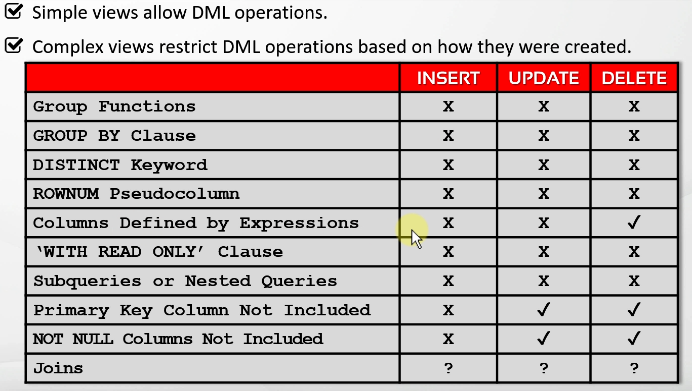

## Using the WITH CHECK OPTION Clause

Used to ensure that the user cannot perform any DML operations that the view
cannot select.

```sql
CREATE OR REPLACE VIEW empvw80 AS
    SELECT
        employee_id,
        first_name,
        last_name,
        email,
        hire_date,
        job_id
    FROM employees_copy
    WHERE department_id = 80
WITH CHECK OPTION CONSTRAINT emp_dept_80_chk;
```

- If a constraint is violated, or the DML is performed violating the WHERE clause,
  it will be denied.
  - In this example, nothing can be inserted that doesn't have the `department_id`
    as 80. Also applies to updates.
- To see all constraints: `SELECT * FROM user_constraints;`
- Cannot be used with `WITH READ ONLY` clause

## Preventing DML Operations on a View

```sql
CREATE OR REPLACE VIEW empvw80 AS
    SELECT
        employee_id,
        first_name,
        last_name,
        email,
        hire_date,
        job_id
    FROM employees_copy
    WHERE department_id = 80
WITH READ ONLY CONSTRAINT emp_80_rok;
```

- Cannot be used with `WITH CHECK OPTION` clause

## Dropping Views

```sql
DROP VIEW view_name;
```

- Does not cause data loss on the base tables

# Section 19: Data Dictionary Views

A set of __read-only__ tables that provides administrative metadata about the 
database and database objects.

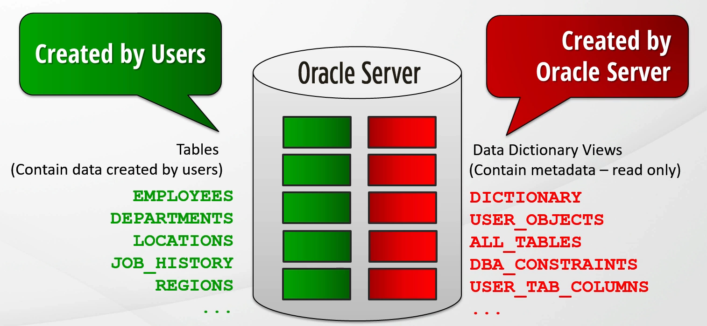

- Created and maintained by the Oracle Server
- Used by the Oracle DB itself or users including developers, DBA's and application
  designers.
- <u>__Read-Only__</u>

## What's In A Data Dictionary View?

- Definitions of all schema objects in the database (tables, views, functions,
  indexes, etc.)
- Names of all users
- Default values for columns
- Constraint information
- Privileges of users

## Dictionary View

We can find the complete list of all data dictionary views in the view named
`DICTIONARY`

- All data dictionary view names are written in uppercase.

```sql
-- Searching user tables
SELECT * FROM dictionary WHERE table_name = 'USER_TABLES';

-- Searching comments to find the right table for security
SELECT * FROM dictionary WHERE UPPER(COMMENTS) LIKE '%SECURITY%';

-- Searching comments to find all tables related to constraints
SELECT * FROM dictionary WHERE UPPER(COMMENTS) LIKE '%CONSTRAINT%';

SELECT * FROM DICT  -- Alias for DICTIONARY
```

## USER, DBA, ALL, V$ Prefixes

- `USER` : Includes all the objects in the user's schema
- `ALL`  : Includes all the objects in user's schema and the objects that the 
  user can access in all schemas.
- `DBA`  : Includes all the objects of all users. Only DBAs and users who have
  the required privileges can access these data dictionary views.
- `V$`   : Includes views that have information about database performance. Only
  DBAs and users who have the privileges can access these data dictionary views.

### USER_OBJECTS View

Contains the following info:

| Column Name     | Description                                                    |
|:----------------|:---------------------------------------------------------------|
| `OBJECT_NAME`   | Name of the object                                             |
| `OBJECT_TYPE`   | Type of the object (Table, view, etc.)                         |
| `CREATED`       | Time of creation of the object                                 |
| `LAST_DDL_TIME` | Last modification time of the object (Cahanging the structure) |
| `STATUS`        | Status of the object (Valid, invalid, N/A)                     |
| `GENERATED`     | Whether this object is system-generated or not (Y/N)           |

```sql
SELECT * FROM user_objects;

SELECT * FROM user_catalog;
```

- `CAT` View (`USER_CATALOG`): Cat is a synonym for the `USER_CATALOG` view which
  returns just the __table_name__ and the __table_type__ columns which list
  tables, views, synonyms and sequences of the user.
  - Also shows tables in the recycle bin

### ALL_OBJECTS View

Used to see all objects that we own and all the objects that the user can access
in all schemas.

```sql
SELECT * FROM all_objects;
```

### DBA View

Used to see all objects of all users __including system objects__.

```sql
SELECT * FROM dba_objects;
```

## USER_TABLES Data Dictionary View

Shows all the tables that we own.

```sql
SELECT * FROM user_tables;

SELECT * FROM tabs;  -- Synonym for user_tables view;
```

There are `OBJECTS`, `TABLES`, and `INDEXES` for `USER`, `ALL`, and `DBA`.

## USER_TAB_COLUMNS Data Dictionary View

Used to see all the columns of all tables and views that we own. Has info like:

- Table Name
- Column Name
- Data Type
- Data Length
- ...

```sql
SELECT * FROM user_tab_columns;

SELECT * FROM cols;  - Synonym for user_tab_columns;

-- Example
SELECT
    column_name,
    data_type,
    data_length,
    nullable,
    data_default,
    num_nulls,
    avg_col_len,
    num_disctinct
FROM user_tab_columns
WHERE table_name = 'DEPARTMENTS';
```

- Often used to query a specific table's columns and column properties using the
  user_tab_columns view.

## USER_CONSTRAINTS VIEW

Used to display all the information about the constraints on our tables.

| Column Name         | Description                                                                 |
|:--------------------|:----------------------------------------------------------------------------|
| `OWNER`             | Owner of the table                                                          |
| `CONSTRAINT_NAME`   | Name of the constraint                                                      |
| `CONSTRAINT_TYPE`   | Type of the constraint                                                      |
| `TABLE_NAME`        | Name of the table associated with the constraint                            |
| `STATUS`            | Status of the constraint (ENABLED / DISABLED)                               |
| `INDEX_NAME`        | The index used by the constraint                                            |
| `SEARCH_CONDITION`  | Rule for the condition (Example: `NOT NULL`)                                |
| `R_CONSTRAINT_NAME` | Name of the unique constraint in the referenced table                       |
| `DELETE_RULE`       | Delete rule fora referential constraint (`CASCADE`, `SET NULL`, `NO ACTION` |

Constraint types for `CONSTRAINT_TYPE`:

- __C__ Check Constraint
- __P__ Primary Key
- __U__ Unique Key
- __R__ Referential Integrity (Foreign Key)
- __V__ With Check Option (Used For Views)
- __O__ With Read-Only (Used For Views)

#### Useful Columns In USER_CONSTRAINTS

```sql
SELECT
    owner,
    table_name,
    constraint_name,
    constraint_type,
    search_condition,
    r_constraint_name,
    delete_rule,
    status,
    index_name
FROM user_constraints;
```

## USER_CONS_COLUMNS Data Dictionary Views

Stores information about all the column - constraint pairs of our tables and 
views.

- Has critical information such as owner, constraint_name, table_name, column_name,
  and position.

```sql
SELECT * FROM user_cons_columns;
```

### Joined Example

```sql
SELECT b.constraint_type, a.*, b.r_constraint_name
FROM user_cons_columns a
JOIN user_constraints b
    ON (a.table_name = b.table_name AND a.constraint_name = b. constraint_name);
```

## USER_VIEWS Data Dictionary View

Shows the details about views that the user owns.

```sql
SELECT * FROM user_views;
```

## USER_TAB_COMMENTS & USER_COL_COMMENTS Data Dictionary Views

- `USER_TAB_COMMENTS` __(Used to see all the comments of our tables and views)__
- `USER_COL_COMMENTS` __(Used to see all the comments of columns of tables and
  views.)__
- Tables or columns with no comments are returned with `NULL` in the comment
  column.
- These views can also be used to find a table or column by searching some
  keywords from their comments.

```sql
SELECT *
FROM user_tab_comments
WHERE UPPER(comments) LIKE '%EMPLOYEE%';
```

# Section 20: Oracle Sequences

## General Notes

- A sequence is a user-created object that automatically generates unique integer
  numbers.
- Generally used for populating primary key column values.
- `IDENTITY` column
  - Similar to `AUTO_INCREMENT` in MySQL
- A sequence is a shareable object that can be shared by multiple users
- Sequence numbers are stored independent of tables so a sequence can be used
  by multiple users and for multiple tables.
- Sequence numbers cannot be rolled back.
- Can be used anywhere to generate unique numbers.
- Sequence access efficiency can be improved by caching sequences in memory
- `PURGE RECYCLEBIN;` will delete everything in the recycle bin.

## Creating Sequences

```sql
CREATE SEQUENCE [schema_name.]sequence_name
[ { START WITH start_num }
  { INCREMENT BY increment_num }
  { MAXVALUE max_num | NOMAXVALUE }
  { MINVALUE min_num | NOMINVALUE }
  { CYCLE | NOCYCLE }
  { CACHE cache_num | NOCACHE }
  { ORDER | NOORDER }
];
```

- `START WITH` is __1__ by default.
- `INCREMENT BY` is __1__ by default.
  - A negative nubmer can also be specified.
- When `MAXVALUE` is reached, it will start over. _(Default)_
- `CYCLE` After reaching its max or min value, the sequence continues to
  generate numbers starting with the min or max value.
- `NOCYCLE` Stops generating numbers after reaching the max value. _(Default)_
  - Should be used when used with a `PRIMARY` or `UNIQUE` key.
- `CACHE` Specified how many values are pre-allocated in memory by the Oracle 
  server. _(Default)_
  - __20__ sequence values are cached by default.
- `NOCACHE` No value is kept in memory.
- `ORDER` guarantees that sequence numbers are generated in order of request.
- `NOORDER` If you do not need to ensure that Oracle generates sequence numbers
  in order of request, `NOORDER` can be used. _(Default)_

## Modifying Sequences

`ALTER SEQUENCE` is used to modify a sequence.

```sql
ALTER SEQUENCE [schema_name.]sequence_name
[ 
  { INCREMENT BY increment_num }
  { MAXVALUE max_num | NOMAXVALUE }
  { MINVALUE min_num | NOMINVALUE }
  { CYCLE | NOCYCLE }
  { CACHE cache_num | NOCACHE }
  { ORDER | NOORDER }
];
```

- Only future sequence numbers are affected.
- We must be the owner of the sequence or have the `ALTER ANY SEQUENCE` privilege
  to modify a sequence.
- We cannot use the `START WITH` option while modifying a sequence.
  - We must drop and re-create the sequence to start the sequence from a different
    number.
- While modifying the sequences, some validations are performed (e.g., `MAXVALUE`
  cannot be smaller than the `CURRENT` value.)

## Dropping Sequences

```sql
DROP SEQUENCE sequence_name;
```

- We must be the owner of the sequence or have the `DROP ANY SEQUENCE` privilege
  to modify a sequence.

## Using Sequences

- `NETVAL` __(used to get the next <u>__value__</u> of a sequence)__
- `CURRENTVAL` __(used to get the <u>__current__</u> value of a sequence)__

```sql
SELECT sequence_name.NEXTVAL FROM dual;

SELECT sequence_name.CURRVAL FROM dual;
```

- If you try to retrieve the current value without initializing it for your 
  session, you will get an error.
  - Initialize it with `nextval`.
- Do not get the next value unless you need it.

To catch a sequence up to a table, you can run:

```sql
SELECT sequence_name.NEXTVAL from <table>;
```

- The sequence will be run once per row in `table`.

#### Places A Sequence Can Be Used

- In the __`SELECT` list of a query__ (not in a subquery or a view).
- In the __`SELECT` list of a subquery__ in an __`INSERT`__ statement.
- In the __`VALUES`__ part of a __`INSERT`__ statement.

#### Places A Sequence Cannot Be Used

- With the `DSTINCT` keyword
- In the `GROUP BY` clause
- In the `HAVING` clause
- In the `ORDER BY` clause

## Using Sequences As Default Values

- We can use `CURRVAL` or `NEXTVAL` as a default value as long as the sequence
  exists.

```sql
CREATE TABLE temp(
    column1 NUMBER DEFAULT employee_seq.NEXTVAL NOT NULL,
    column2 VARCHAR2(50)
)
```

## Sequence Caching

Sequences can be cached in memory to improve performance.

- Cache size can be defined when the sequence is initially created or altered.
  - Default: 20
- The specified number of sequence values is cached into memory on the first call.
- After the last cached sequence value in memory is used, the next set of sequence
  values is cached.
- Cached sequence values will be lost on any systemf ailure, even if you haven't
  used them all.

## USER_SEQUENCES View

Shows the properties of all the sequences that the current user owns.

```sql
DESCRIBE user_sequences;

SELECT * FROM user_sequences;
```

- `SEQUENCE_NAME`: Name of the dsequence
- `MINVALUE`: Minimum value of the sequence
- `MAXVALUE`: Maximum value of the sequence
- `INCREMENT_BY`: Specified interval between sequence numbers
- `CYCLE_FLAG`: Whether the sequence starts with the minimum value after reaching
  the maximum value (__Y=CYCLE/N=NOCYCLE__)
- `ORDER_FLAG`: Whether sequence numbers are generated in order (__Y=ORDER / 
  N=NOORDER__)
- `CACHE_SIZE`: Number of sequence values stored in memory
- `LAST_NUMBER`: Last sequence number written to disk or the maximum value in
  the cache (if sequence caching is active).
- `SCALE`: Indicates whether this is a scalable sequence or not.
- `EXTEND_FLAG`: Indicates whether this scalable sequence's values can be more
  than the __max value__ or less than the __min value__.
- `SHARDED_FLAG`: Indicates whether this is a sharded sequence or not.
- `SESSION_FLAG`: Indicates whether the sequence is session-specific or not.
- `KEEP_VALUE`: Indicates whether the sequence values are kept after a failure
  or not.

## IDENTITY Column

The `IDENTITY` column automatically generates and inserts sequential values into
the related column.

```sql
GENERATED [ALWAYS | BY DEFAULT [ON NULL]] AS IDENTITY [(identity options)]
```

- `GENERATED ALWAYS`: Always generates a value on each insert. _(Default)_
  - Cannot insert into this column when this option is set.
- `GENERATED BY DEEFAULT`: Generates a value only if no value is provided.
  - Cannot insert `NULL` into this column when this option is set.
- `GENERATED BY DEEFAULT ON NULL`: Generates a value only if a `NULL` value or
  nothing is specified.
- `identity options`: Sequence options for creating the `IDENTITY` column
  sequence.
  - Same set of properties as a sequence.
- `START WITH LIMIT VALUE` sets the existing maximum/minimum value + `INCREMENT
  BY` value as the `START WITH` value.
- The `USER_TAB_IDENTITY_COLS` view can be used to query all the identity columns.
- The `SYS.IDNSEQ$` view stores the link between the table and the sequence.

#### Examples

```sql
CREATE TABLE temp (
    ID NUMBER GENERATED AS IDENTITY,
    text VARCHAR2(100)
);
```

#### Dropping The IDENTITY Column

The `DROP IDENTITY` clause removes the identity property but keeps the column.

```sql
ALTER TABLE table_name
MODIFY column_name
    DROP IDENTITY;
```

#### IDENTITY Column Restrictions

- A table can only have one identity column
- Identity columns must be numeric data types
- Identity column is not inheirted when using a __CTAS statement__.
- Identity column cannot have another `DEFAULT` value.
- Identity columns implicitly have `NOT NULL` and `NOT DEFERRABLE` constraints.
- The `CREATE SEQUENCE` privilege is needed to create an identity column.

# Section 21: Oracle Synonyms

## General Notes

- A synonym is a database object created to give an alternative name to another
  database object.
- We can think of synonyms as an alias
- Advantages of Synonyms:
  - Useful for hiding the identity and location of the related object
  - Eliminate the need of typing the owner of an object
  - Useful for simplifying (abbreviating) object names
  - Useful for backward compatibility
  - Helpful in moving the objects between schemas without breaking the existing
    code.
  - No need for additional privileges for the synonyms.
  - Require no storage in the database other than its definition in the data
    dictionary views.

## Creating, Using, and Dropping Synonyms

```sql
CREATE [OR REPLACE] [PUBLIC] SYNONYM [schema_name.]synonym_name 
    FOR [schema_name.]object_name[@db_link];
```

- To use a synonym created for another user's objects ,the usern eeds to have the
  related object privileges.
- Synonyms created without the `PUBLIC` option are considered private synonyms.
- To create a private synonym in your schema, the `CREATE SYNONYM` privilege is
  needed.
- To create a private synonym in another user's schema, the `CREATE ANY SYNONYM`
  privilege is required.
- We can create synonyms for our objects or other schema objects in our schema
  or in another schema.
- DBAs or the users having the `CREATE PUBLIC SYNONYM` privilege can create 
  `PUBLIC` synonyms.
- `db_link` is used to reach another database.
- A private synonym should be unique amongst the objects in its schema, and a
  public synonym should be unique amongst public synonyms.
- Private synonyms have a higher precedence than public synonyms.
- A synonym is used as an alias for the underlying object.
- We can create synonyms for nonexistent objects and those for which we don't
  have access privileges at creation time.
- A private synonym name cannot be created with the same name as the underlying
  object, but a public one can.

```sql
DROP [PUBLIC] SYNONYM [schema_name.]synonym_name[@db_link];
```

## Analyzing The USER_SYNONYMS View

```sql
DESC user_synonyms;
```

`SYNONYM_NAME`: Name of the synonym
`TABLE_OWNER`: Owner of the object referenced by the synonym
`TABLE_NAME`: Name of the object referenced by the synonym
`DB_LINK`: Database link referencing remote system
`ORIGIN_CON_ID`: ID of the containing database
  - __0__ For non-container database
  - __0__ For non-container database
  - __1__ For the __Root__ database
